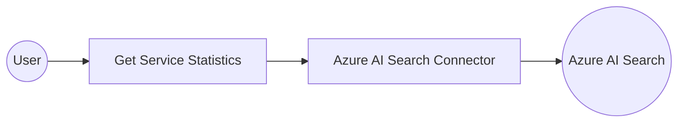

# Example

## What you'll build

Build a scheduled automation that connects to an Azure AI Search service, retrieves service-level statistics, and logs the result. The integration uses the `ballerinax/azure.ai.search` connector to call the management API and return storage, document counts, and quota usage.

**Operations used:**
- **Get Service Statistics** : Retrieves service-level statistics including document counts, index usage, and storage quota from Azure AI Search.

## Architecture

## Prerequisites

- An active Azure subscription with an Azure AI Search resource provisioned.
- An Azure Search service URL in the format `https://<your-service-name>.search.windows.net`.
- An Azure Search Admin API key, available in the Azure portal under **Keys**.

## Setting up the Azure AI Search integration

> **New to WSO2 Integrator?** Follow the [Create a New Integration](../../../../develop/create-integrations/create-new-integration.md) guide to set up your integration first, then return here to add the connector.

## Adding the Azure AI Search connector

### Step 1: Open the connector palette

Select **Add Connection** (or the **+** icon in the **Connections** panel) from the integration overview. A connector palette appears showing pre-built connectors.

### Step 2: Select the Azure AI Search connector

Enter `search` in the search field. Two Azure AI Search packages appear. Select **`ballerinax/azure.ai.search`** (the management API for indexes, indexers, and statistics).

## Configuring the Azure AI Search connection

### Step 3: Fill in the connection parameters

In the **Configure Search** panel, bind each field to a configurable variable:

- **serviceUrl** : The Azure AI Search service URL, bound to the `azureSearchServiceUrl` configurable variable.
- **apiKey** : The Azure Search Admin API key, bound to the `azureSearchApiKey` configurable variable.
- **connectionName** : Keep the default value `searchClient`.

### Step 4: Save the connection

Select **Save Connection** to persist the connection. The integration canvas updates to show the `searchClient` connection node under **Connections**.

### Step 5: Set actual values for your configurables

1. In the left panel, select **Configurations**.
2. Set a value for each configurable listed below.

- **azureSearchServiceUrl** (string) : The full Azure AI Search service URL, for example `https://my-service.search.windows.net`.
- **azureSearchApiKey** (string) : The Admin API key from the Azure portal under **Keys**.

## Configuring the Azure AI Search Get Service Statistics operation

### Step 6: Add an Automation entry point

Select **+ Add Artifact** in the **Design** panel. From the artifact picker, select **Automation** and select **Create**. The canvas switches to the Automation flow editor, showing a **Start** node connected to an **Error Handler**.

### Step 7: Select and configure the Get Service Statistics operation

Select the **+** node between **Start** and **Error Handler**. Expand **Connections → searchClient** to view all available operations.

Select **Get Service Statistics** and fill in the operation fields:

- **Api-version** : The Azure REST API version string, for example `2023-11-01`.
- **Result** : The variable name to store the returned `search:ServiceStatistics` record, set to `result`.

Select **Save**. The completed automation flow now shows the full **Start → Get Service Statistics → Error Handler** sequence on the canvas.

## Try it yourself

Try this sample in WSO2 Integration Platform.

[View source on GitHub](https://github.com/wso2/integration-samples/tree/main/connectors/azure.ai.search_connector_sample)

## More code examples

The `Azure AI Search` connector provides practical examples illustrating usage in various scenarios. Explore these [examples](https://github.com/ballerina-platform/module-ballerinax-azure.ai.search/tree/main/examples/), covering the following use cases:

1. [RAG ingestion](https://github.com/ballerina-platform/module-ballerinax-azure.ai.search/tree/main/examples/rag-ingestion) - A comprehensive example demonstrating the complete Azure AI Search workflow including data source creation, index creation, indexer setup, and execution.
