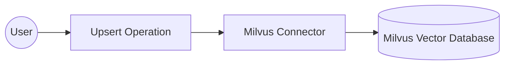

# Example

## What you'll build

Build a WSO2 Integrator automation that connects to a Milvus vector database and upserts vector data into a collection. The integration logs the response returned by the Milvus server.

**Operations used:**
- **Upsert** : Inserts or updates vector data in a specified Milvus collection

## Architecture

## Prerequisites

- A running Milvus instance (local or cloud)
- A Milvus authentication token

## Setting up the Milvus integration

> **New to WSO2 Integrator?** Follow the [Create a New Integration](../../../../develop/create-integrations/create-new-integration.md) guide to set up your integration first, then return here to add the connector.

## Adding the Milvus connector

Select the **+ (Add Connection)** button next to **Connections** in the sidebar to open the connector palette.

1. Select **+ (Add Connection)** next to **Connections** to open the connector palette.
2. Search for "milvus" in the search field.
3. Select the **Milvus** connector card.

## Configuring the Milvus connection

Configure the connection parameters by binding each field to a configurable variable.

### Step 1: Fill in the connection parameters

Enter the connection details, binding each field to a configurable variable:

- **serviceUrl** : The URL of your Milvus server, bound to a configurable variable
- **authConfig** : Authentication token for Milvus, bound to a configurable variable
- **connectionName** : The name used to identify this connection on the canvas

### Step 2: Save the connection

Select **Save Connection** to persist the connection. The `milvusClient` connection appears on the project design canvas.

### Step 3: Set actual values for your configurables

1. In the left panel, select **Configurations**.
2. Set a value for each configurable listed below.

- **milvusServiceUrl** (string) : The full URL of your Milvus server (for example, the address where your Milvus instance is accessible)
- **milvusToken** (string) : The authentication token used to connect to your Milvus instance

## Configuring the Milvus upsert operation

### Step 4: Add an Automation entry point

1. Select **+ Add Artifact** in the **Design** section header.
2. Select **Automation** from the artifacts panel.
3. Leave all defaults and select **Create**.

The canvas switches to the Automation flow view, showing a **Start** node connected to an **Error Handler**.

### Step 5: Select and configure the upsert operation

1. Select the **+** (add step) button between **Start** and the **Error Handler** node.
2. Under **Connections**, expand **milvusClient** to reveal available operations.

3. Select **Upsert** from the operations list.
4. In the **milvusClient → upsert** form, select the **Expression** tab for the **Request** field and enter your upsert payload, specifying the collection name and vector data.

- **request** : An `milvus:UpsertRequest` value containing the target collection name and the vector data to upsert

5. Select **Save**.

## Try it yourself

Try this sample in WSO2 Integration Platform.

[View source on GitHub](https://github.com/wso2/integration-samples/tree/main/connectors/milvus_connector_sample)
