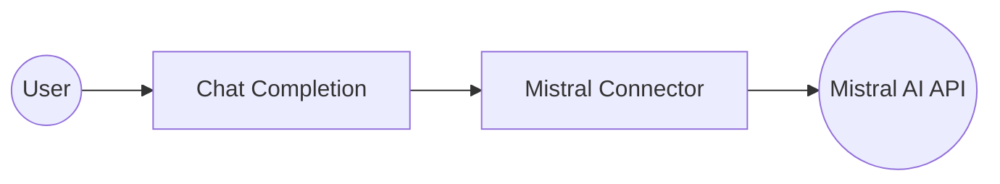

# Example

## What you'll build

Build a Mistral AI chat completion integration using the `ballerinax/mistral` connector that invokes Mistral's chat completion API to answer a user question and logs the response. The integration uses an Automation entry point to trigger the operation manually or on a schedule.

**Operations used:**
- **Chat Completion** : Sends a user message to the Mistral API and retrieves a generated response

## Architecture

## Prerequisites

- A valid Mistral API key from [console.mistral.ai](https://console.mistral.ai)

## Setting up the Mistral integration

> **New to WSO2 Integrator?** Follow the [Create a New Integration](../../../../develop/create-integrations/create-new-integration.md) guide to set up your integration first, then return here to add the connector.

## Adding the Mistral connector

Open the Connections panel and select **+ Add Connection**.

### Step 1: Search for and select the Mistral connector

1. In the search field, enter `mistral`.
2. Select **Mistral** from the search results.

## Configuring the Mistral connection

### Step 2: Fill in the Mistral connection parameters

After selecting the Mistral connector, the **Configure Mistral** form opens. Bind the connection parameters to configurable variables:

- **Config** : Authentication configuration using a bearer token referencing the `mistralApiKey` configurable variable
- **Connection Name** : The name used to reference this connection in the flow

### Step 3: Save the connection

Select **Save Connection** to persist the connection. The design canvas returns and shows the `mistralClient` connection card.

### Step 4: Set actual values for your configurables

1. In the left panel, select **Configurations**.
2. Set a value for each configurable listed below.

- **mistralApiKey** (string) : Your Mistral API key from console.mistral.ai

## Configuring the Mistral Chat Completion operation

### Step 5: Add an Automation entry point

1. Select **+ Add Artifact** on the design canvas.
2. Select **Automation** from the artifacts panel.
3. Select **Create**.

The canvas switches to the Automation flow view showing **Start** and **Error Handler** nodes.

### Step 6: Select the Chat Completion operation and configure its parameters

Select the **+** button on the flow canvas to open the **Node Panel**. Expand the `mistralClient` connection to view available operations, then select **Chat Completion**. Configure the operation parameters:

- **Payload** : The request payload containing the messages array and model name, referencing a user message expression
- **Result** : The variable name that stores the chat completion response

Select **Save** to apply the configuration. The canvas updates to show the Chat Completion node connected to `mistralClient`.

## Try it yourself

Try this sample in WSO2 Integration Platform.

[View source on GitHub](https://github.com/wso2/integration-samples/tree/main/connectors/mistral_connector_sample)
