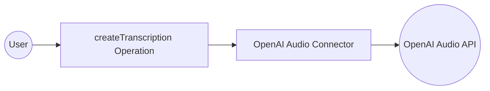

# Example

## What you'll build

Build an automation that transcribes audio using the OpenAI Audio connector. The integration calls the `createTranscription` operation with the `whisper-1` model and logs the result.

**Operations used:**
- **createTranscription** : Transcribes audio into the input language using the `whisper-1` model

## Architecture

## Prerequisites

- An OpenAI API key

## Setting up the OpenAI Audio integration

> **New to WSO2 Integrator?** Follow the [Create a New Integration](../../../../develop/create-integrations/create-new-integration.md) guide to set up your integration first, then return here to add the connector.

## Adding the OpenAI Audio connector

Search for the OpenAI Audio connector in the connector palette and add it to your project.

### Step 1: Open the connector palette

Select **+ Add Artifact** → **Connection** from the project overview canvas to open the connector search palette.

## Configuring the OpenAI Audio connection

### Step 2: Fill in the connection parameters

Enter the connection details by binding the auth token to a configurable variable. In the **Config** field, select the **Record** toggle and use the **Configurables** tab to create a new configurable variable named `openaiApiToken` of type `string` with no default value, then inject it as the token value. Set the connection name to `audioClient`.

- **Config** : Authentication configuration using a bearer token; bind to the `openaiApiToken` configurable variable
- **Connection Name** : Name used to reference this connection throughout the integration

### Step 3: Save the connection

Select **Save Connection** to persist the connection. Confirm that `audioClient` appears in the Connections panel.

### Step 4: Set actual values for your configurables

1. In the left panel, select **Configurations**.
2. Set a value for each configurable listed below.

- **openaiApiToken** (string) : Your OpenAI API key (for example, `sk-...`)

## Configuring the OpenAI Audio createTranscription operation

### Step 5: Add an automation entry point

Select **+ Add Artifact** → **Automation** from the project canvas, then select **Create** to open the low-code flow canvas with a **Start** node and an **Error Handler**.

### Step 6: Select and configure the createTranscription operation

1. Select the **+** button on the flow canvas to open the node panel.
2. Expand **Connections → audioClient** to see available operations.

3. Select **Transcribes audio into the input language** (`createTranscription`) and fill in the operation parameters.

- **file → fileContent** : Byte array containing the audio data to transcribe
- **file → fileName** : Name of the audio file being submitted
- **model** : The transcription model to use; set to `whisper-1`
- **Result** : Variable name that stores the transcription response

Select **Save**.

## Try it yourself

Try this sample in WSO2 Integration Platform.

[View source on GitHub](https://github.com/wso2/integration-samples/tree/main/connectors/openai.audio_connector_sample)

## More code examples

The `OpenAI Audio` connector provides practical examples illustrating usage in various scenarios. Explore these [examples](https://github.com/ballerina-platform/module-ballerinax-openai.audio/tree/main/examples/), covering the following use cases:

1. [International news translator](https://github.com/ballerina-platform/module-ballerinax-openai.audio/tree/main/examples/international-news-translator) - Converts a text news given in any language to english
2. [Meeting transcriber and translator](https://github.com/ballerina-platform/module-ballerinax-openai.audio/tree/main/examples/meeting-transcriber-and-translator) - Converts an audio given in a different language into text in input language and english
