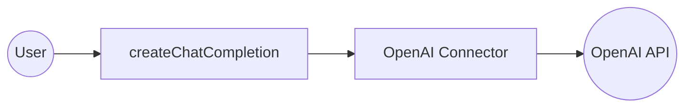

# Example

## What you'll build

Build a WSO2 Integrator automation that connects to the OpenAI API and calls the `createChatCompletion` operation to generate a chat response. The integration sends a user message to the OpenAI `gpt-4o` model and logs the API response to the console.

**Operations used:**
- **createChatCompletion** : Sends a chat message to an OpenAI model and returns a generated response.

## Architecture

## Prerequisites

- An OpenAI API key

## Setting up the OpenAI integration

> **New to WSO2 Integrator?** Follow the [Create a New Integration](../../../../develop/create-integrations/create-new-integration.md) guide to set up your integration first, then return here to add the connector.

## Adding the OpenAI connector

Add the OpenAI connector to your integration from the **Connections** panel.

### Step 1: Open the Add connection palette

1. In the side-bar, expand the project tree and select **+** next to **Connections**.
2. The **Add Connection** palette opens on the right.

## Configuring the OpenAI connection

Configure the OpenAI connection by binding the API token to a configurable variable and saving the connection.

### Step 2: Fill in the connection parameters

Enter the connection details by binding the API token to a configurable variable so the key is never hard-coded.

1. Select the **Config** field; a **Record Configuration** modal opens.
2. Locate the `auth` > `token` field and place the cursor inside the `token` value expression box.
3. Open the **Configurables** tab and select **+ New Configurable**.
4. Name it `openaiApiKey` with type `string`, then select **Save**.
5. Confirm the expression updates to `{auth: {token: openaiApiKey}}`, then select **Save** in the **Record Configuration** modal.
6. Enter `openaiClient` in the **Connection Name** field.

- **Config** : The OpenAI connection configuration record; binds the `auth.token` sub-field to the `openaiApiKey` configurable variable
- **Connection Name** : The name used to reference this connection on the canvas

### Step 3: Save the connection

Select **Save Connection** to persist the connection. The canvas now shows the `openaiClient` connection node.

### Step 4: Set actual values for your configurables

1. In the left panel, select **Configurations**.
2. Set a value for each configurable listed below.

- **openaiApiKey** (string) : Your OpenAI API key used to authenticate requests to the OpenAI API

## Configuring the OpenAI createChatCompletion operation

Add an Automation entry point, then select and configure the `createChatCompletion` operation.

### Step 5: Add an Automation entry point

1. In the side-bar, select **+** next to **Entry Points**.
2. Select **Automation**, then select **Add**. An **Automation** entry point appears in the tree and the flow canvas opens.

### Step 6: Select and configure the createChatCompletion operation

Select the `createChatCompletion` operation from the **openaiClient** connection and configure its parameters.

1. Select the dashed placeholder on the canvas to open the node panel.
2. Select **openaiClient** to expand its operations.

3. Find **createChatCompletion** and select it.
4. Select **Expression** mode for the **Payload** field and enter `{model: "gpt-4o", messages: [{role: "user", content: "Hello, OpenAI!"}]}`.
5. Enter `result` in the **Result** field, then select **Save**.

- **Payload** : The chat completion request body, including the model name and the list of messages to send
- **Result** : The variable name that stores the `CreateChatCompletionResponse` returned by the API

## Try it yourself

Try this sample in WSO2 Integration Platform.

[View source on GitHub](https://github.com/wso2/integration-samples/tree/main/connectors/openai_connector_sample)

## More code examples

The `ballerinax/openai` connector provides practical examples illustrating usage in various scenarios. Explore these [examples](https://github.com/ballerina-platform/module-ballerinax-openai/tree/main/examples), covering the following use cases:

1. [**Financial Assistant**](https://github.com/ballerina-platform/module-ballerinax-openai/tree/main/examples/financial-assistant) - Build a Personal Finance Assistant that helps users manage their budget, track expenses, and get financial advice.
2. [**Marketing Image Generator**](https://github.com/ballerina-platform/module-ballerinax-openai/tree/main/examples/marketing-image-generator) - Creates an assistant that takes a user's description from the console, makes a DALL·E image with it.
