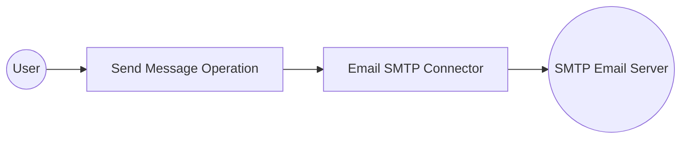

# Example

## What you'll build

Build an email automation integration that connects to an SMTP server and sends an email message using the Email SMTP connector in WSO2 Integrator. Configure an SMTP connection with configurable variables for secure credential management, then send a structured email message through the automation flow.

**Operations used:**
- **Send Message** : Sends a full `email:Message` record (to, subject, body, and optional fields such as cc, bcc, and attachments) through the configured SMTP connection

## Architecture

## Prerequisites

- An SMTP-enabled email account (e.g., Gmail with App Password, SendGrid, or similar)

## Setting up the Email SMTP integration

> **New to WSO2 Integrator?** Follow the [Create a New Integration](../../../../develop/create-integrations/create-new-integration.md) guide to set up your integration first, then return here to add the connector.

## Adding the Email SMTP connector

### Step 1: Open the connector palette

In the left sidebar, select the **WSO2 Integrator** tab. Under your project, hover over **Connections** in the tree and select the **+** (Add Connection) button that appears to open the connector palette.

### Step 2: Select the Email SMTP connector

Enter `email` in the search bar and select **Email Smtp** to open the connection configuration form.

## Configuring the Email SMTP connection

### Step 3: Fill in the connection parameters

Bind each field to a configurable variable using the helper panel. For each field, select the **Open Helper Panel** icon next to the field, select the **Configurables** tab, select **+ New Configurable**, enter the variable name and type, then select **Save**.

- **host** : SMTP server hostname (bind to a `string` configurable variable)
- **username** : Email account username (bind to a `string` configurable variable)
- **password** : Email account password or App Password (bind to a `string` configurable variable)
- **port** : SMTP port — switch to **Expression** mode first, then bind to an `int` configurable variable
- **security** : Set to `SSL` from the dropdown

### Step 4: Save the connection

Select **Save Connection** to persist the connection. The form closes and the canvas shows the `emailSmtpclient` connection node.

### Step 5: Set actual values for your configurables

In the left panel, select **Configurations**. Set a value for each configurable listed below.

- **emailHost** (string) : The SMTP server hostname (e.g., `smtp.gmail.com`)
- **emailUsername** (string) : Your email account username
- **emailPassword** (string) : Your email account password or App Password
- **emailPort** (int) : The SMTP port number (e.g., `465` for SSL)

## Configuring the Email SMTP Send Message operation

### Step 6: Add an Automation entry point

From the **Design** canvas, select **+ Add Artifact**, then select **Automation**. In the **Create New Automation** panel, leave the defaults and select **Create** to open the automation flow canvas.

### Step 7: Select and configure the Send Message operation

Select the **+** (add step) button between the **Start** node and the **Error Handler** to open the step panel. Under **Connections**, expand `emailSmtpclient` to reveal available operations.

Select **Send Message** to open the operation configuration form. Switch the **Email** field to **Expression** mode and enter the email record with the following fields:

- **to** : The recipient email address
- **subject** : The email subject line
- **body** : The plain-text email body

> **Note:** The `email:Message` record also supports optional fields such as `htmlBody`, `cc`, `bcc`, `replyTo`, `attachments`, and `contentType`.

Select **Save** to add the step to the automation flow.

## Try it yourself

Try this sample in WSO2 Integration Platform.

[View source on GitHub](https://github.com/wso2/integration-samples/tree/main/connectors/email_connector_sample)
