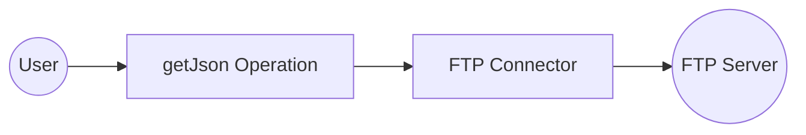

# Example

## What you'll build

Build a WSO2 Integrator automation that connects to a remote FTP server, retrieves a JSON file using the `getJson` operation, and logs its contents. The workflow uses configurable variables to manage FTP credentials securely.

**Operations used:**
- **getJson** : Retrieves a JSON file from a specified path on the FTP server and returns its contents as a `json` value

## Architecture

## Prerequisites

- Access to an FTP server with a JSON file at a known path
- FTP server credentials (host, port, username, and password)

## Setting up the FTP integration

> **New to WSO2 Integrator?** Follow the [Create a New Integration](../../../../develop/create-integrations/create-new-integration.md) guide to set up your integration first, then return here to add the connector.

## Adding the FTP connector

Select **Add Connection** in the WSO2 Integrator sidebar to open the connector palette.

### Step 1: Open the connector palette and select the FTP connector

1. In the WSO2 Integrator sidebar, expand **Connections** and select the **+** button next to it.
2. In the connector palette search box, enter `ftp`.
3. Select the **FTP** card (under `ballerina/ftp`, labeled "Standard").

## Configuring the FTP connection

### Step 2: Bind connection parameters to configurable variables

Set the **Client Config** field using four configurable variables. Use the **Configurables** tab in the helper panel to create each variable:

- **ftpHost** (string) : Hostname or IP address of the FTP server
- **ftpPort** (int) : Port number used by the FTP server (default `21`)
- **ftpUsername** (string) : Username for FTP authentication
- **ftpPassword** (string) : Password for FTP authentication

After creating all four configurables, enter the following record literal in the **Client Config** expression field and set **Connection Name** to `ftpClient`.

### Step 3: Save the connection

Select **Save Connection** to persist the connection. The form closes and the canvas displays the `ftpClient` connection node.

### Step 4: Set actual values for your configurables

1. In the left panel, select **Configurations**.
2. Set a value for each configurable listed below.

- **ftpHost** (string) : The hostname or IP address of your FTP server (for example, `ftp.example.com`)
- **ftpPort** (int) : The port your FTP server listens on
- **ftpUsername** (string) : Your FTP account username
- **ftpPassword** (string) : Your FTP account password

## Configuring the FTP getJson operation

### Step 5: Add an Automation entry point

1. Select **+ Add Artifact** on the canvas toolbar.
2. Under **Automation**, select the **Automation** tile.
3. Select **Create** — no additional configuration is needed.

The `main` automation entry point appears in the sidebar under **Entry Points**, and the canvas switches to the Automation flow editor showing a **Start** node.

### Step 6: Select the getJson operation and configure its parameters

1. Select the **+** button on the canvas between **Start** and **Error Handler**.
2. In the right-side node panel, expand **Connections → ftpClient**.

3. Select **Get Json** and fill in the operation form:

- **Path** : Path to the JSON file on the FTP server (for example, `/data/sample.json`)
- **Result** : Name of the variable that stores the returned value
- **Target Type** : The expected return type (`json`)

4. Select **Save**.

## Try it yourself

Try this sample in WSO2 Integration Platform.

[View source on GitHub](https://github.com/wso2/integration-samples/tree/main/connectors/ftp_connector_sample)
