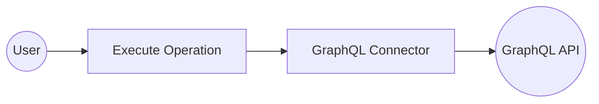

# Example

## What you'll build

Build a WSO2 Integrator automation that connects to a GraphQL endpoint using the `ballerinax/graphql` connector. The integration sends a GraphQL query and receives a response from the configured GraphQL server.

**Operations used:**
- **Execute** : Sends a GraphQL document query to the configured endpoint and returns the response.

## Architecture

## Prerequisites

- A GraphQL endpoint URL to connect to.

## Setting up the GraphQL integration

> **New to WSO2 Integrator?** Follow the [Create a New Integration](../../../../develop/create-integrations/create-new-integration.md) guide to set up your integration first, then return here to add the connector.

## Adding the GraphQL connector

### Step 1: Open the Add Connection palette

Select **+ Add Connection** on the WSO2 Integrator canvas to open the connection palette.

### Step 2: Find and select the GraphQL connector

1. Enter `graphql` in the search field.
2. Select **ballerina/graphql** from the results to open the **Configure GraphQL** form.

## Configuring the GraphQL connection

### Step 3: Bind connection parameters to configurable variables

Bind each field to a configurable variable using the helper panel.

- **serviceUrl** : The GraphQL server endpoint URL
- **forwarded** : Controls forwarded header behavior (default: `"disable"`)

### Step 4: Save the connection

Select **Save Connection** to persist the connection. The `graphqlClient` node appears on the canvas.

### Step 5: Set actual values for your configurables

In the left panel, select **Configurations** and set a value for each configurable listed below.

- **graphqlServiceUrl** (string) : The full URL of the GraphQL endpoint (for example, `https://countries.trevorblades.com/`)
- **graphqlForwarded** (string) : The forwarded header value (for example, `"disable"`)

## Configuring the GraphQL Execute operation

### Step 6: Add an Automation entry point

1. Select **+ Add Artifact** on the canvas.
2. Under **Automation**, select **Automation**.
3. Select **Create** to scaffold the `main` entry point.

### Step 7: Select and configure the Execute operation

1. Select the **+** button between **Start** and **Error Handler** on the canvas to open the step-addition panel.
2. Under **Connections**, expand **graphqlClient** to view available operations.

3. Select **Execute** to open the operation configuration form and fill in the following fields:

- **document** : The GraphQL query string to send (for example, `"{ __typename }"`)
- **result** : The variable name that stores the response
- **targetType** : The expected response type (for example, `graphql:GenericResponseWithErrors`)

Select **Save** to add the `execute` step to the flow.

## Try it yourself

Try this sample in WSO2 Integration Platform.

[View source on GitHub](https://github.com/wso2/integration-samples/tree/main/connectors/graphql_connector_sample)
