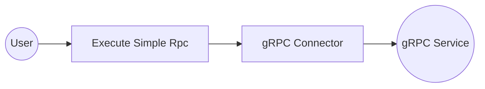

# Example

## What you'll build

Build a WSO2 Integrator automation that connects to a remote gRPC service and performs a unary (simple) RPC call. The integration sends a request payload to the gRPC service and logs the response.

**Operations used:**
- **Execute Simple Rpc** : Performs a unary gRPC call, sending one request and receiving one response

## Architecture

## Prerequisites

- Access to a running gRPC service endpoint

## Setting up the gRPC integration

> **New to WSO2 Integrator?** Follow the [Create a New Integration](../../../../develop/create-integrations/create-new-integration.md) guide to set up your integration first, then return here to add the connector.

## Adding the gRPC connector

Select **Connections** in the WSO2 Integrator sidebar, then select the **+** button to open the connector palette.

### Step 1: Search for and select the gRPC connector

1. Enter `grpc` in the search box.
2. Select the **gRPC** card (`ballerina/grpc`)—the generic gRPC client connector for unary and streaming calls.

> **Note:** Don't select "gRPC Caller" or streaming-only variants. Choose the card labelled simply **gRPC**.

## Configuring the gRPC connection

### Step 2: Fill in the connection form

Bind the connection parameters to configurable variables. Select the grid icon next to the **Url** field to open the helper panel, switch to the **Configurables** tab, and create a new configurable named `grpcServiceUrl` of type `string`.

- **Connection Name** : Name used to identify this connection in the integration
- **Url** : The gRPC service endpoint URL, bound to the `grpcServiceUrl` configurable variable

### Step 3: Save the connection

Select **Save** at the bottom of the connection form. The `grpcClient` connection node appears on the canvas and in the sidebar under **Connections**.

### Step 4: Set actual values for your configurables

In the left panel, select **Configurations** and set a value for each configurable listed below.

- **grpcServiceUrl** (string) : The full URL of your gRPC server (for example, the server's host and port)

## Configuring the gRPC Execute Simple Rpc operation

### Step 5: Add an automation entry point

1. Select the **+** button next to **Entry Points** in the WSO2 Integrator sidebar.
2. Select **Automation** from the artifacts panel.
3. Select **Create** to confirm the default settings.

The `main` automation entry point is created and the canvas shows a flow with **Start** → **Error Handler**.

### Step 6: Select and configure the Execute Simple Rpc operation

1. Select the **+** (Add Step) button inside the automation flow body.
2. Under **Connections**, expand **grpcClient** to reveal its operations list.

3. Select **Execute Simple Rpc** and fill in the operation form.

- **Method ID** : The full method path in the format `/Package.Service/Method` (for example, `"HelloWorld/hello"`)
- **Payload** : The request message sent to the gRPC service
- **Result** : The variable name used to store the response tuple

Select **Save**. The `grpc : executeSimpleRPC` node appears on the canvas between **Start** and **Error Handler**.

## Try it yourself

Try this sample in WSO2 Integration Platform.

[View source on GitHub](https://github.com/wso2/integration-samples/tree/main/connectors/grpc_connector_sample)
