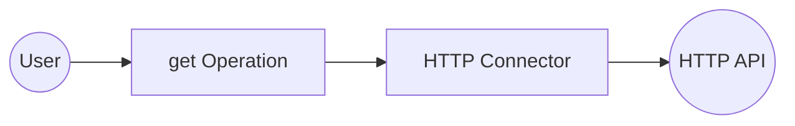

# Example

## What you'll build

Build an HTTP GET integration using the `ballerinax/http` HTTP Client connector in WSO2 Integrator's low-code canvas. The integration sends an outbound GET request to a configurable URL and captures the HTTP response. The flow runs as an Automation entry point named `main`.

**Operations used:**
- **get** : Sends an HTTP GET request to a specified path and returns the HTTP response.

## Architecture

## Setting up the HTTP integration

> **New to WSO2 Integrator?** Follow the [Create a New Integration](../../../../develop/create-integrations/create-new-integration.md) guide to set up your integration first, then return here to add the connector.

## Adding the HTTP connector

Select **+ Add Connection** in the **Connections** section of the WSO2 Integrator sidebar to open the connector palette.

## Configuring the HTTP connection

### Step 1: Fill in connection parameters

In the **New Connection** form, bind the connection parameters to configurable variables:

- **connectionName** : Set to `httpClient` as the name for this connection
- **url** : Bind to a new configurable variable named `httpServiceUrl` (type: `string`) using the variable binding icon

### Step 2: Save the connection

Select **Save** to create the connection. The connection `httpClient` now appears under **Connections** in the WSO2 Integrator sidebar.

### Step 3: Set actual values for your configurables

1. In the left panel, select **Configurations**.
2. Set a value for each configurable listed below.

- **httpServiceUrl** (string) : The base URL of the HTTP service to send GET requests to (for example, `https://your-target-api.com`)

## Configuring the HTTP get operation

### Step 4: Add an Automation entry point

1. In the WSO2 Integrator sidebar, hover over **Entry Points** and select **+**.
2. Select **Automation** from the entry point types.

An Automation entry point named `main` is created and the low-code canvas opens, showing **Start → (empty node placeholder) → Error Handler**.

### Step 5: Select the get operation and configure its parameters

1. Select the empty placeholder node on the canvas to open the node panel.
2. Expand the **httpClient** connection and select **get** from the list of available operations.
3. Fill in the operation parameters:

- **path** : Enter `/` as the request path
- **result** : Set the result variable name to `result`
- **targetType** : Enter `http:Response` as the expected response type

## Try it yourself

Try this sample in WSO2 Integration Platform.

[View source on GitHub](https://github.com/wso2/integration-samples/tree/main/connectors/http_connector_sample)
