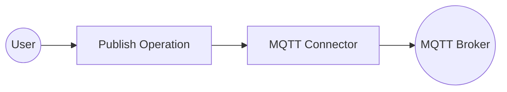

# Example

## What you'll build

Build a WSO2 Integrator automation that connects to an MQTT broker and publishes a message to a configured topic. The integration uses configurable variables for the broker URI, client ID, and topic, making it easy to adapt to different environments.

**Operations used:**
- **Publish** : Sends a message with a byte-encoded payload to a specified MQTT broker topic

## Architecture

## Prerequisites

- A running MQTT broker accessible at a known URI

## Setting up the MQTT integration

> **New to WSO2 Integrator?** Follow the [Create a New Integration](../../../../develop/create-integrations/create-new-integration.md) guide to set up your integration first, then return here to add the connector.

## Adding the MQTT connector

Add the MQTT connector connection to provide broker connectivity.

### Step 1: Open the Add connection panel

Select **Add Connection** (the **+** button in the **Connections** section) on the integration canvas to open the connector palette.

### Step 2: Select the MQTT connector

1. In the **Search connectors...** box, enter `mqtt`.
2. Select **MQTT Client** (the `ballerinax/mqtt` connector — choose **Client**, not **Caller**) to open the connection form.

## Configuring the MQTT connection

### Step 3: Fill in connection parameters

Enter the following connection parameters, binding each to a configurable variable:

- **Server Uri** : The MQTT broker URI (bound to a configurable variable)
- **Client Id** : A unique identifier for this MQTT client (bound to a configurable variable)
- **Connection Name** : The name used to reference this connection on the canvas

### Step 4: Save the connection

Select **Save Connection** to persist the connection. The `mqttClient` connection node appears on the design canvas.

### Step 5: Set actual values for your configurables

In the left panel, select **Configurations** and set a value for each configurable listed below:

- **mqttServerUri** (string) : The full URI of your MQTT broker (for example, `tcp://your-broker-host:1883`)
- **mqttClientId** (string) : A unique client identifier for this connection (for example, `"mqtt-client-01"`)
- **mqttTopic** (string) : The topic to publish messages to (for example, `"test/topic"`)

## Configuring the MQTT Publish operation

### Step 6: Add an Automation entry point

In the left sidebar under **Entry Points**, select **Add Entry Point** (**+**), then select **Automation**. Select **Create** to create the automation with default configuration. The automation canvas opens showing a **Start** node and an **Error Handler** node.

### Step 7: Select and configure the Publish operation

1. Select the **+** button between the **Start** node and the **Error Handler** node to open the node panel.
2. In the **Connections** section of the node panel, select **mqttClient** to expand it.

3. Select **Publish** from the operations list to open the publish operation form.
4. Configure the following fields:
   - **Topic** : Set to expression mode and bind to the `mqttTopic` configurable variable
   - **Message** : Set to expression mode and enter `{payload: "Hello World".toBytes()}` to create an `mqtt:Message` record with a byte-encoded payload
   - **Result** : Leave the default value `mqttDeliverytoken` (type `mqtt:DeliveryToken`)

Select **Save** to add the publish step to the automation flow.

## Try it yourself

Try this sample in WSO2 Integration Platform.

[View source on GitHub](https://github.com/wso2/integration-samples/tree/main/connectors/mqtt_connector_sample)
