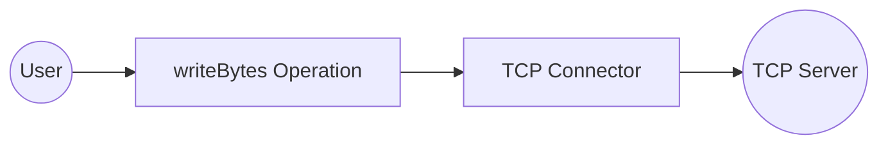

# Example

## What you'll build

Build a TCP connector integration that connects to a remote TCP server and sends a byte message. The integration uses an Automation entry point to invoke the `writeBytes` operation and transmit data to the configured TCP host.

**Operations used:**
- **writeBytes** : Sends a `byte[]` payload to the connected remote TCP host

## Architecture

## Prerequisites

- A running TCP server with a reachable host and port

## Setting up the TCP integration

> **New to WSO2 Integrator?** Follow the [Create a New Integration](../../../../develop/create-integrations/create-new-integration.md) guide to set up your integration first, then return here to add the connector.

## Adding the TCP connector

Select **+ Add Connection** from the Artifacts panel and search for **TCP** in the connector palette. Select the **TCP** connector — not "TCP Caller".

## Configuring the TCP connection

### Step 1: Fill in the TCP connection parameters

Bind each connection parameter to a configurable variable in the **Configure TCP** form:

- **Remote Host** : Binds to the `tcpHost` configurable variable (string) representing the remote server hostname
- **Remote Port** : Binds to the `tcpPort` configurable variable (int) representing the remote server port
- **Connection Name** : Keep the default value `tcpClient`

### Step 2: Save the TCP connection

Select **Save Connection**. The `tcpClient` connection appears on the integration canvas and in the sidebar under **Connections**.

### Step 3: Set actual values for your configurables

1. In the left panel, select **Configurations**.
2. Set a value for each configurable listed below.

- **tcpHost** (string) : The hostname or IP address of the remote TCP server
- **tcpPort** (int) : The port number of the remote TCP server

## Configuring the TCP writeBytes operation

### Step 4: Add an Automation entry point

Select **+ Add Artifact** on the canvas, then select **Automation** from the Artifacts panel and select **Create**. This creates a `main` automation entry point and opens the flow canvas.

### Step 5: Select the writeBytes operation and configure its parameters

1. Inside the automation flow, select the **+** button between Start and Error Handler to open the node panel.
2. Under **Connections → tcpClient**, expand to reveal the available operations.

3. Select **Write Bytes** and fill in the operation fields.

- **Data** : Enter `"Hello World".toBytes()` as the byte payload to send to the remote TCP host

## Try it yourself

Try this sample in WSO2 Integration Platform.

[View source on GitHub](https://github.com/wso2/integration-samples/tree/main/connectors/tcp_connector_sample)
