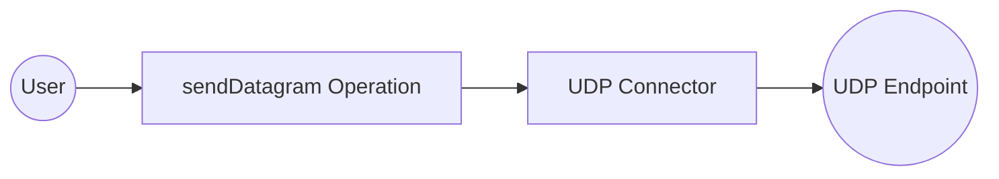

# Example

## What you'll build

Build an integration that sends a UDP datagram using the **ballerina/udp** connector in WSO2 Integrator. You'll configure a connectionless UDP client, add an Automation entry point, and invoke the `sendDatagram` operation to transmit bytes over UDP.

**Operations used:**
- **sendDatagram** : Transmits a UDP datagram record (containing remote host, remote port, and byte data) to a target endpoint

## Architecture

## Setting up the UDP integration

> **New to WSO2 Integrator?** Follow the [Create a New Integration](../../../../develop/create-integrations/create-new-integration.md) guide to set up your integration first, then return here to add the connector.

## Adding the UDP connector

### Step 1: Open the connector palette and select the UDP connector

In the WSO2 Integrator left panel, expand **Connections** and select the **+** (Add Connection) button to open the connector palette.

## Configuring the UDP connection

### Step 2: Configure the UDP connection form

Expand the **Advanced Configurations** section and bind the **Local Host** field to a new configurable variable. Select the **Open Helper Panel** icon next to **Local Host**, go to the **Configurables** tab, and select **+ New Configurable**. Enter `udpLocalHost` as the variable name with type `string`, then select **Add**. The **Connection Name** is auto-filled as `udpClient`. Select **Save** to persist the connection.

- **localHost** : Binds the UDP client to a specific local network interface using the `udpLocalHost` configurable variable

### Step 3: Verify the connection node on the canvas

Confirm the `udpClient` connection node is visible in the **Connections** panel after saving.

### Step 4: Set actual values for your configurables

In the left panel, select **Configurations**. Set a value for each configurable listed below.

- **udpLocalHost** (string) : The local network interface address to bind the UDP client (for example, `0.0.0.0` to bind to all interfaces)

## Configuring the UDP sendDatagram operation

### Step 5: Add an Automation entry point

Select **Add Artifact**, choose **Automation** from the artifact type list, leave the function name as `main`, and select **Create**. The Automation flow canvas opens showing a **Start** node, an empty step placeholder, and an **Error Handler** node.

### Step 6: Select and configure the sendDatagram operation

On the Automation canvas, select the placeholder node between **Start** and **Error Handler** to open the node panel. In the **Connections** section, expand **udpClient** to reveal its operations, then select **Send Datagram**.

In the **Datagram** field, switch to **Expression** mode and enter the following record expression with these values:

- **remoteHost** : The hostname or IP address of the UDP target
- **remotePort** : The port number on the remote host to send the datagram to
- **data** : The byte array payload to transmit (for example, `"Hello UDP World".toBytes()`)

Select **Save** to add the step to the automation flow.

## Try it yourself

Try this sample in WSO2 Integration Platform.

[View source on GitHub](https://github.com/wso2/integration-samples/tree/main/connectors/udp_connector_sample)
