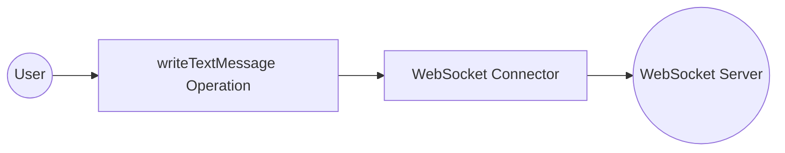

# Example

## What you'll build

Build a WSO2 Integrator integration that sends a UTF-8 text frame to a WebSocket server using the `ballerinax/websocket` connector. The integration uses an Automation entry point to trigger the message send, with the WebSocket server URL stored as a configurable variable to avoid hard-coded values.

**Operations used:**
- **writeTextMessage** : Sends a text message to a WebSocket server connection.

## Architecture

## Prerequisites

- A running WebSocket server reachable at a known URL (e.g., `ws://your-websocket-server/chat`).

## Setting up the WebSocket integration

> **New to WSO2 Integrator?** Follow the [Create a New Integration](../../../../develop/create-integrations/create-new-integration.md) guide to set up your integration first, then return here to add the connector.

## Adding the WebSocket connector

### Step 1: Open the Add Connection palette

In the WSO2 Integrator explorer panel, expand your project and select the **+** button next to **Connections** to open the **Add Connection** palette.

### Step 2: Select the WebSocket connector

1. In the search box, enter `websocket`.
2. Select the **Websocket** card (`ballerinax/websocket`)—the WebSocket client connector.

## Configuring the WebSocket connection

### Step 3: Fill in the connection parameters

In the **Configure Websocket** form, bind the required field to a configurable variable:

- **connectionName** : Leave the pre-populated value `websocketClient` as-is.
- **url** : Select the configurable helper, add a new configurable named `websocketServiceUrl` of type `string`, and confirm the field is bound to that variable.

### Step 4: Save the connection

Select **Save Connection** to persist the connection. Confirm that `websocketClient` now appears in the **Connections** panel.

### Step 5: Set actual values for your configurables

1. In the left panel, select **Configurations**.
2. Set a value for each configurable listed below.

- **websocketServiceUrl** (string) : The full WebSocket server URL to connect to (e.g., `ws://your-websocket-server/chat`).

## Configuring the WebSocket writeTextMessage operation

### Step 6: Add an Automation entry point

In the WSO2 Integrator explorer, select **Add Artifact**, choose **Automation** from the artifact type list, leave the default name (`main`), and select **Create**. The Automation canvas opens showing **Start** → *(empty drop zone)* → **Error Handler**.

### Step 7: Select and configure the writeTextMessage operation

1. On the Automation canvas, select the empty placeholder between **Start** and **Error Handler** to open the node panel.
2. Under **Connections**, expand **websocketClient** to reveal its available operations.

3. Select **Write Text Message** (`writeTextMessage`) from the operations list and fill in the parameter:

- **data** : The text message to send to the WebSocket server, e.g., `"Hello, WebSocket!"`.

4. Select **Save** to add the step to the Automation flow.

## Try it yourself

Try this sample in WSO2 Integration Platform.

[View source on GitHub](https://github.com/wso2/integration-samples/tree/main/connectors/websocket_connector_sample)
