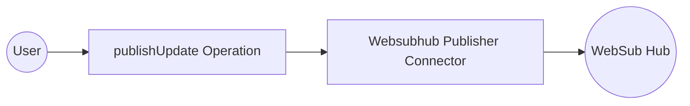

# Example

## What you'll build

Build a WSO2 Integrator automation that publishes a topic update to a remote WebSub Hub using the `ballerina/websubhub` connector. The integration creates a connection to the hub, then calls the `publishUpdate` operation to deliver a JSON payload to a specified topic.

**Operations used:**
- **publishUpdate** : Publishes a content update for a given topic to the configured WebSub Hub

## Architecture

## Prerequisites

- A running WebSub Hub endpoint with a valid URL
- A registered topic on the hub to publish updates to

## Setting up the Websubhub Publisher integration

> **New to WSO2 Integrator?** Follow the [Create a New Integration](../../../../develop/create-integrations/create-new-integration.md) guide to set up your integration first, then return here to add the connector.

## Adding the Websubhub Publisher connector

Add the Websubhub Publisher connection to your integration project.

### Step 1: Open the connector palette and select the Websubhub Publisher connector

1. In the WSO2 Integrator sidebar, select **+ Add Artifact**.
2. Search for **websub** in the artifact palette and select **Websubhub Publisher** (from `ballerina/websubhub`).

## Configuring the Websubhub Publisher connection

### Step 2: Fill in the connection parameters

In the **Add Connection** form, bind each parameter to a configurable variable:

- **Connection Name** : A unique name for this connection instance
- **Hub URL** : The URL of the remote WebSub Hub, bound to the `websubHubUrl` configurable variable

### Step 3: Save the connection

Select **Save** to create the connection. The new connection appears in the **Connections** panel.

### Step 4: Set actual values for your configurables

1. In the left panel, select **Configurations**.
2. Set a value for each configurable listed below.

- **websubHubUrl** (string) : The full URL of the remote WebSub Hub endpoint

## Configuring the Websubhub Publisher publishUpdate operation

### Step 5: Add the Automation entry point

1. In the WSO2 Integrator sidebar, select **+ Add Artifact**.
2. Select **Automation** as the artifact type.
3. Set the function name to `main` (default).
4. Select **Create** — the Automation flow canvas opens.

### Step 6: Select the publishUpdate operation and configure its parameters

1. In the Automation flow canvas, select the **+** drop zone between **Start** and **Error Handler**.
2. Expand the **websubhubPublisherclient** section in the node panel.
3. Select **Publish Update** to open the operation configuration panel.

Fill in the operation fields:

- **Topic** : The topic URL to publish the update to, bound to the `websubTopic` configurable variable
- **Payload** : The JSON content to deliver to subscribers
- **Result** : The variable name that receives the `websubhub:Acknowledgement` response

Select **Save** — the `publishUpdate` node appears on the flow canvas.

## Try it yourself

Try this sample in WSO2 Integration Platform.

[View source on GitHub](https://github.com/wso2/integration-samples/tree/main/connectors/websub_connector_sample)
