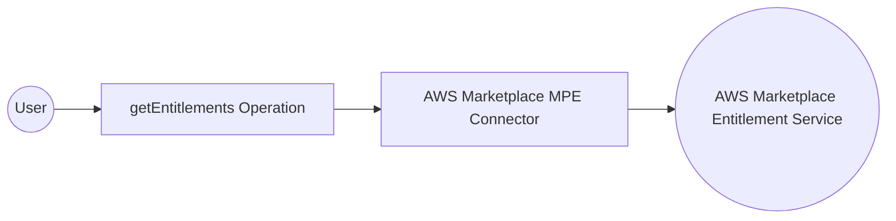

# Example

## What you'll build

Build a WSO2 Integrator automation that retrieves AWS Marketplace product entitlements using the AWS Marketplace MPE connector. The integration connects to the AWS Marketplace Entitlement Service using your AWS credentials and fetches entitlement data for a specified product code.

**Operations used:**
- **getEntitlements** : Retrieves entitlement records for a given AWS Marketplace product code

## Architecture

## Prerequisites

- An AWS account with Marketplace access
- AWS credentials: Access Key ID and Secret Access Key

## Setting up the AWS Marketplace MPE integration

> **New to WSO2 Integrator?** Follow the [Create a New Integration](../../../../develop/create-integrations/create-new-integration.md) guide to set up your integration first, then return here to add the connector.

## Adding the AWS Marketplace MPE connector

### Step 1: Open the Add Connection palette

Select the **+** (Add Connection) button in the Design canvas to open the **Add Connection** palette, which lists available connectors.

### Step 2: Search and select the connector

1. In the search box, enter `mpe` or `aws marketplace`.
2. Select **Aws Marketplace Mpe** from the results to open the **Configure Mpe** connection form.

## Configuring the AWS Marketplace MPE connection

### Step 3: Configure connection parameters

Bind all parameters to configurable variables so credentials are never hardcoded. Use Expression mode (toggle the `{}` icon) for each field:

- **region** : The AWS region for the Marketplace Entitlement Service endpoint
- **accessKeyId** : AWS IAM Access Key ID used to authenticate requests
- **secretAccessKey** : AWS IAM Secret Access Key used to authenticate requests
- **connectionName** : The name used to identify this connection on the canvas

### Step 4: Save the connection

Select **Save Connection** to persist the connection. The `mpeClient` connection node appears on the Design canvas and under **Connections** in the sidebar.

### Step 5: Set actual values for your configurables

1. In the left panel, select **Configurations**.
2. Set a value for each configurable listed below.

- **awsRegion** (string) : AWS region identifier (for example, `us-east-1`) cast to `mpe:Region`
- **awsAccessKeyId** (string) : Your AWS IAM Access Key ID
- **awsSecretAccessKey** (string) : Your AWS IAM Secret Access Key

## Configuring the AWS Marketplace MPE getEntitlements operation

### Step 6: Add an Automation entry point

In the sidebar, select **Entry Points** → **+ Add Entry Point** → **Automation** to open the Automation flow canvas.

### Step 7: Select and configure the getEntitlements operation

1. On the Automation canvas, select the **+** button between **Start** and **Error Handler** to open the **Add Step** panel.
2. Expand **mpeClient** under the Connections section to reveal available operations.

3. Select **Get Entitlements** to open the operation configuration form.
4. Fill in the fields:

- **productCode** : The AWS Marketplace product code to retrieve entitlements for; switch to Expression mode and create a new configurable variable `awsProductCode` (type: `string`)
- **resultVariableName** : Name of the variable to hold the response (default: `mpeEntitlementsresponse`)

Select **Save** to add the `mpe : getEntitlements` step to the flow canvas. The step node appears connected between **Start** and **Error Handler**, with the result variable `mpeEntitlementsresponse` shown beneath the node label.

## Try it yourself

Try this sample in WSO2 Integration Platform.

[View source on GitHub](https://github.com/wso2/integration-samples/tree/main/connectors/aws.marketplace.mpe_connector_sample)
