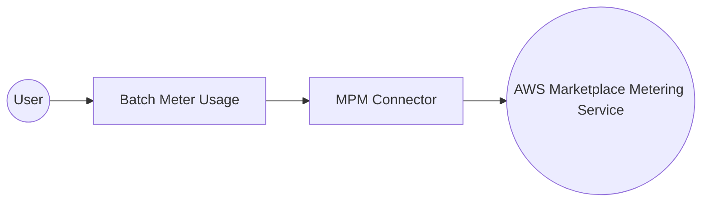

# Example

## What you'll build

Build an automation that connects to the **AWS Marketplace Metering Service** and submits usage records for AWS Marketplace sellers. The integration uses configurable variables for AWS credentials and calls `batchMeterUsage` to report metering data in a single request.

**Operations used:**
- **Batch Meter Usage** : Submits usage records for multiple customers in a single call

## Architecture

## Prerequisites

- An AWS account with `accessKeyId` and `secretAccessKey` that have Marketplace Metering permissions
- A registered AWS Marketplace product with a valid product code

## Setting up the MPM integration

> **New to WSO2 Integrator?** Follow the [Create a New Integration](../../../../develop/create-integrations/create-new-integration.md) guide to set up your integration first, then return here to add the connector.

## Adding the MPM connector

### Step 1: Open the Add Connection palette

In the left sidebar, hover over the **Connections** section and select the **Add Connection** button that appears in the toolbar. The connector palette opens with a search field at the top.

### Step 2: Search and select the connector

Enter `aws.marketplace.mpm` in the search field and select the **Mpm** connector card. The **Configure Mpm** form opens.

## Configuring the MPM connection

### Step 3: Fill in the connection parameters

In the **Configure Mpm** form, bind each field to a configurable variable so credentials aren't hardcoded.

1. Select the **Region** dropdown and choose the AWS region where your Marketplace product is registered.
2. Select the **Auth** field to open the **Record Configuration** panel, then use the **Configurables** tab to create `awsAccessKeyId` (`string`) and `awsSecretAccessKey` (`string`) configurable variables and reference them in the auth record.
3. Leave **Connection Name** as `mpmClient` or enter a preferred name.

- **region** : The AWS region where your Marketplace product is registered
- **auth** : An `AuthConfig` record containing `accessKeyId` and `secretAccessKey`, each bound to a configurable variable

### Step 4: Save the connection

Select **Save Connection** to persist the connection. The **mpmClient** connection node appears on the canvas.

### Step 5: Set actual values for your configurables

1. In the left panel, select **Configurations**.
2. Set a value for each configurable listed below.

- **awsAccessKeyId** (string) : Your AWS access key ID with Marketplace Metering permissions
- **awsSecretAccessKey** (string) : Your AWS secret access key with Marketplace Metering permissions

## Configuring the MPM Batch Meter Usage operation

### Step 6: Add an Automation entry point

Select **+ Add Artifact** on the canvas toolbar and select **Automation** from the artifact palette. In the **Create New Automation** panel, select **Create**. A `main` Automation entry point appears under **Entry Points** and the canvas switches to the Automation flow view.

### Step 7: Select the operation and configure its parameters

1. Select the **+** button inside the Automation flow canvas (between Start and Error Handler) to open the node panel.
2. Under **Connections → mpmClient**, select **Batch Meter Usage** to open the operation form.

Configure the following parameters:

- **productCode** : Your 15-character AWS Marketplace product code (for example, `"prod-abc123xyzdefgh"`)
- **usageRecords** : Select **Initialize Array** to add usage records; each record requires `customerId`, `dimension`, `quantity`, and `timestamp`
- **Result** : Auto-generated variable name `mpmBatchmeterusageresponse` of type `mpm:BatchMeterUsageResponse`

Select **Save** to add the operation to the flow.

## Try it yourself

Try this sample in WSO2 Integration Platform.

[View source on GitHub](https://github.com/wso2/integration-samples/tree/main/connectors/aws.marketplace.mpm_connector_sample)
