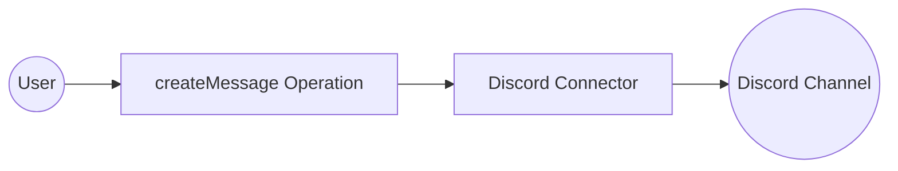

# Example

## What you'll build

Build a low-code integration that sends a message to a Discord channel using the Discord connector in WSO2 Integrator. The integration uses an Automation entry point to invoke the `create_message` operation, which posts a message to a specified channel via the Discord REST API.

**Operations used:**
- **create_message** : Posts a text message to a Discord channel using Bearer token authentication

## Architecture

## Prerequisites

- A Discord channel ID where the bot has permission to send messages

## Setting up the Discord integration

> **New to WSO2 Integrator?** Follow the [Create a New Integration](../../../../develop/create-integrations/create-a-new-integration.md) guide to set up your integration first, then return here to add the connector.

## Adding the Discord connector

### Step 1: Open the connector palette

In the Design canvas, select **+ Add Artifact** → **Connection** to open the connector palette.

## Configuring the Discord connection

### Step 2: Fill in the connection parameters

Search for `discord`, select the **ballerinax/discord** connector card to open the connection form, and bind each parameter to a configurable variable:

- **auth** : Bearer token authentication config referencing the `discordToken` configurable variable
- **Connection Name** : `discordClient`

### Step 3: Save the connection

Select **Update Connection** to save the connection. The `discordClient` connection node appears on the Design canvas.

### Step 4: Set actual values for your configurables

1. In the left panel, select **Configurations**.
2. Set a value for each configurable listed below.

- **discordToken** : `string` — your Discord bot token (e.g., `Bot YOUR_DISCORD_BOT_TOKEN_HERE`)

## Configuring the Discord createMessage operation

### Step 5: Add an automation entry point

Select **+ Add Artifact** and select **Automation** under the Automation category. Select **Create** to generate the automation entry point named `main`.

### Step 6: Select and configure the createMessage operation

1. Select the **+** button between the **Start** and **Error Handler** nodes to open the node panel.
2. Under **Connections** in the node panel, select **discordClient** to expand it and reveal all available operations.

3. Select **create_message** from the list of operations, then fill in the operation fields:

- **ChannelId** : the Discord channel ID to post the message to
- **Headers** : content type header for the request
- **Payload** : the message body containing the `content` field with the text to post
- **Result** : variable name to store the API response

4. Select **Save** to add the operation to the Automation flow.

## Try it yourself

Try this sample in WSO2 Integration Platform.

[View source on GitHub](https://github.com/wso2/integration-samples/tree/main/connectors/discord_connector_sample)

## More code examples

The `Discord` connector provides practical examples illustrating usage in various scenarios. Explore these [examples](https://github.com/ballerina-platform/module-ballerinax-discord/tree/main/examples/), covering the following use cases:

1. [Automated Event Reminders](https://github.com/ballerina-platform/module-ballerinax-discord/tree/main/examples/automated-event-reminders) - This use case illustrates how the Discord API can be leveraged to create a scheduled event in a Discord server and automate daily reminders about this event across all channels within the server.
2. [Automated Role Assignment Based on Reactions](https://github.com/ballerina-platform/module-ballerinax-discord/tree/main/examples/automated-role-assignment) - This use case illustrates the utilization of the Discord API to assign roles to members based on their interests, enabling them to gain roles by reacting to designated messages.
