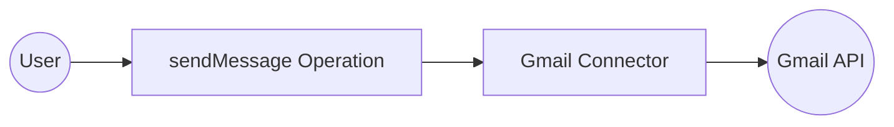

# Example

## What you'll build

Build a low-code integration in WSO2 Integrator that sends an email using the `ballerinax/googleapis.gmail` connector. The integration creates a `gmailClient` connection whose OAuth2 credentials are stored as configurable variables, then calls the `sendMessage` operation to dispatch an email.

**Operations used:**
- **sendMessage** : Sends an email to the recipients specified in the `To`, `Cc`, and `Bcc` headers using the authenticated user's Gmail account.

## Architecture

## Prerequisites

- A Google Cloud project with the Gmail API enabled
- OAuth2 credentials (Client ID, Client Secret, Refresh Token, and Refresh URL) obtained from the Google OAuth2 playground

## Setting up the Gmail integration

> **New to WSO2 Integrator?** Follow the [Create a New Integration](../../../../develop/create-integrations/create-a-new-integration.md) guide to set up your integration first, then return here to add the connector.

## Adding the Gmail connector

Select **+ Add Connection** (or the **+** icon next to **Connections** in the sidebar) to open the connector palette.

### Step 1: Search for and select the Gmail connector

1. Enter `gmail` in the search box.
2. Select **`ballerinax/googleapis.gmail`** from the search results.

## Configuring the Gmail connection

### Step 2: Fill in the connection parameters

After selecting the connector, a **New Connection** form appears. Select the **Config** expression field to open the **Record Configuration** panel. Under the `auth` sub-field, choose **`OAuth2RefreshTokenGrantConfig`** from the dropdown, then enable the optional `refreshUrl` checkbox so all four OAuth2 fields are included. Bind each field to a configurable variable as listed below:

- **refreshUrl** : The OAuth2 token refresh endpoint URL
- **refreshToken** : The OAuth2 refresh token for the Gmail account
- **clientId** : The OAuth2 client ID from your Google Cloud project
- **clientSecret** : The OAuth2 client secret from your Google Cloud project
- **Connection Name** : Set to `gmailClient`

### Step 3: Save the connection

Select **Save** to persist the connection. The **Connections** section in the sidebar now lists `gmailClient`.

> **Note:** The status bar may show "Errors: 1" at this stage. This is expected—the four configurable variables (`gmailClientId`, `gmailClientSecret`, `gmailRefreshToken`, `gmailRefreshUrl`) are referenced but not yet declared. They're resolved after you add them in the next step.

### Step 4: Set actual values for your configurables

1. In the left panel, select **Configurations**.
2. Set a value for each configurable listed below.

- **gmailClientId** (string) : Your Google Cloud OAuth2 client ID
- **gmailClientSecret** (string) : Your Google Cloud OAuth2 client secret
- **gmailRefreshToken** (string) : Your OAuth2 refresh token for the Gmail account
- **gmailRefreshUrl** (string) : The OAuth2 token refresh endpoint, for example `https://oauth2.googleapis.com/token`

## Configuring the Gmail sendMessage operation

### Step 5: Add an automation entry point

1. In the sidebar, hover over **Entry Points** and select **Add Entry Point** (**+**).
2. Select **Automation** from the artifacts panel.
3. Select **Create**.

The sidebar now shows `main` (Automation) under **Entry Points**, and the flow editor opens showing a **Start** node followed by an **Error Handler** node.

### Step 6: Select and configure the sendMessage operation

1. In the automation flow canvas, select the **+** (Add Step) button between the **Start** and **Error Handler** nodes to open the step-addition panel.
2. In the panel, locate the **Connections** section and select **`gmailClient`** to expand it.

3. Select the **sendMessage** operation—described as "Sends the specified message to the recipients in the `To`, `Cc`, and `Bcc` headers."
4. Fill in the operation fields as listed below:

- **userId** : Set to `me` to use the authenticated user's Gmail account
- **Payload** : A `gmail:MessageRequest` record with `to` (array), `subject`, and `bodyInText` fields specifying the recipient, subject line, and email body
- **Result** : Auto-generated as `gmailMessage`

5. Select **Save** to add the step to the flow.

## Try it yourself

Try this sample in WSO2 Integration Platform.

[View source on GitHub](https://github.com/wso2/integration-samples/tree/main/connectors/googleapis.gmail_connector_sample)

## More code examples

The `gmail` connector provides practical examples illustrating usage in various scenarios. Explore these [examples](https://github.com/ballerina-platform/module-ballerinax-googleapis.gmail/tree/master/examples), covering use cases like sending emails, retrieving messages, and managing labels.

1. [Process customer feedback emails](https://github.com/ballerina-platform/module-ballerinax-googleapis.gmail/tree/master/examples/process-mails) - Manage customer feedback emails by processing unread emails in the inbox, extracting details, and marking them as read.

2. [Send maintenance break emails](https://github.com/ballerina-platform/module-ballerinax-googleapis.gmail/tree/master/examples/send-mails) - Send emails for scheduled maintenance breaks

3. [Automated Email Responses](https://github.com/ballerina-platform/module-ballerinax-googleapis.gmail/tree/master/examples/reply-mails) - Retrieve unread emails from the Inbox and subsequently send personalized responses.

4. [Email Thread Search](https://github.com/ballerina-platform/module-ballerinax-googleapis.gmail/tree/master/examples/search-threads)
    Search for email threads based on a specified query.
