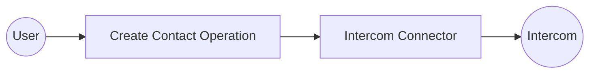

# Example

## What you'll build

Build a WSO2 Integrator automation that creates a new contact in Intercom using the Intercom Contacts API. The integration stores all sensitive values as configurable variables and logs the API response after the contact is created.

**Operations used:**
- **Create contact** : Creates a new contact in Intercom by submitting an email address and role via the Contacts API.

## Architecture

## Prerequisites

- An Intercom account with a valid API bearer token.

## Setting up the Intercom integration

> **New to WSO2 Integrator?** Follow the [Create a New Integration](../../../../develop/create-integrations/create-new-integration.md) guide to set up your integration first, then return here to add the connector.

## Adding the Intercom connector

Select **+ Add Artifact → Connection** from the design canvas to open the Add Connection panel.

### Step 1: Search for and add the Intercom connector

1. Enter `intercom` in the search box.
2. Select **Intercom** from the results to open the connection form.

## Configuring the Intercom connection

### Step 2: Fill in the connection parameters

Bind the connection's `auth` token to a configurable variable. In the **Config** field, enter the following expression using a new configurable named `intercomToken`:

- **Config** : Set to `{auth: {token: intercomToken}}`, where `intercomToken` is a `string` configurable variable holding your Intercom bearer token.

### Step 3: Save the connection

Select **Save Connection** to persist the connection. `intercomClient` now appears under **Connections** in the left sidebar and as a node on the design canvas.

### Step 4: Set actual values for your configurables

1. In the left panel, select **Configurations**.
2. Set a value for each configurable listed below.

- **intercomToken** (string) : Your Intercom API bearer token.
- **contactEmail** (string) : The email address of the contact to create.

## Configuring the Intercom Create contact operation

### Step 5: Add an Automation entry point

Select **+ Add Artifact** on the canvas, then select **Automation** from the artifact picker and select **Create**. The canvas switches to the Automation flow view showing a **Start** node and an **Error Handler**.

### Step 6: Select and configure the Create contact operation

1. Select the **+** (add step) button on the canvas between **Start** and **Error Handler**.
2. Under **Connections**, select **intercomClient** to expand its operations.

3. Enter `contact` in the search box to filter, then select **Create contact**.
4. Configure the operation fields:

- **Payload** : Set to `{email: contactEmail, role: "user"}`, where `contactEmail` is a `string` configurable variable holding the contact's email address.
- **Result** : Set the result variable name to `result`.

## Try it yourself

Try this sample in WSO2 Integration Platform.

[View source on GitHub](https://github.com/wso2/integration-samples/tree/main/connectors/intercom_connector_sample)

## More code examples

The `ballerinax/intercom` connector provides practical examples illustrating usage in various scenarios. Explore these [examples](https://github.com/ballerina-platform/module-ballerinax-intercom/tree/main/examples), covering the following use cases:

1. [Support team analytics](https://github.com/ballerina-platform/module-ballerinax-intercom/tree/main/examples/support-team-analytics) - Demonstrates how to analyze support team performance metrics using the Ballerina Intercom connector.
2. [Priority ticket escalation](https://github.com/ballerina-platform/module-ballerinax-intercom/tree/main/examples/priority-ticket-escalation) - Illustrates automating the escalation of high-priority support tickets.
3. [Support ticket automation](https://github.com/ballerina-platform/module-ballerinax-intercom/tree/main/examples/support-ticket-automation) - Shows how to automate support ticket creation and management workflows.
4. [Knowledge base management](https://github.com/ballerina-platform/module-ballerinax-intercom/tree/main/examples/knowledge-base-management) - Demonstrates managing and updating knowledge base articles programmatically.
