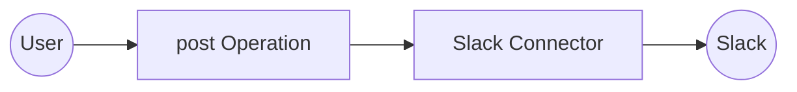

# Example

## What you'll build

Build a WSO2 Integrator automation that posts a message to a Slack channel using the Slack connector. The integration connects to your Slack workspace using a Bot OAuth token and sends a text message to a specified channel.

**Operations used:**
- **post** : Sends a message to a Slack channel with a specified payload.

## Architecture

## Prerequisites

- A Slack Bot OAuth token (starts with `xoxb-`)
- A Slack workspace with a channel to post messages to

## Setting up the Slack integration

> **New to WSO2 Integrator?** Follow the [Create a New Integration](../../../../develop/create-integrations/create-a-new-integration.md) guide to set up your integration first, then return here to add the connector.

## Adding the Slack connector

### Step 1: Open the connector palette

In the WSO2 Integrator sidebar, hover over **Connections** to reveal the **Add Connection** button. Select it to open the connector palette.

In the search box, enter `slack` to filter connectors, then select **ballerinax/slack** from the results to open the **Add Connection** form.

## Configuring the Slack connection

### Step 2: Fill in the connection parameters

In the connection configuration form, bind each field to a configurable variable:

- **connectionName** : Enter `slackClient` as the connection name
- **auth.token** : Set to the `slackAuthToken` configurable variable of type `string`

### Step 3: Save the connection

Select **Save** to create the connection. The `slackClient` connection node appears on the canvas and under **Connections** in the sidebar.

### Step 4: Set actual values for your configurables

In the left panel, select **Configurations**. Set a value for each configurable listed below:

- **slackAuthToken** (string) : Your Slack Bot OAuth token (starts with `xoxb-`)

## Configuring the Slack post operation

### Step 5: Add an automation entry point

In the WSO2 Integrator sidebar, hover over **Entry Points** to reveal the **Add Entry Point** button. Select it to open the artifact type selector, then select **Automation**. Accept the default settings and select **Create**.

The automation flow opens in the canvas, showing **Start**, a placeholder node, and **Error Handler**.

### Step 6: Select and configure the post operation

Select the **+** button between the **Start** and **Error Handler** nodes to open the node selection panel. Under **Connections**, select **slackClient** to expand its available operations.

Select **post** from the list to open the operation configuration form, then fill in the fields:

- **channel** : The Slack channel to post the message to (for example, `general`)
- **text** : The message text to send
- **result** : The variable name to store the response (default `slackChatpostmessageresponse`)

Select **Save** to add the step to the flow.

## Try it yourself

Try this sample in WSO2 Integration Platform.

[View source on GitHub](https://github.com/wso2/integration-samples/tree/main/connectors/slack_connector_sample)

## More code examples

The `Slack` connector provides practical examples illustrating usage in various scenarios. Explore these [examples](https://github.com/ballerina-platform/module-ballerinax-slack/tree/master/examples), covering the following use cases:

1. [Automated Summary Report](https://github.com/ballerina-platform/module-ballerinax-slack/tree/master/examples/automated-summary-report) - This use case demonstrates how the Slack API can be utilized to generate a summarized report of daily stand-up chats in the general channel.

2. [Survey Feedback Analysis](https://github.com/ballerina-platform/module-ballerinax-slack/tree/master/examples/survey-feedback-analysis) - This use case demonstrates how the Slack API can be utilized to perform a company-wide survey by creating a dedicated channel to receive and track feedback replies.
