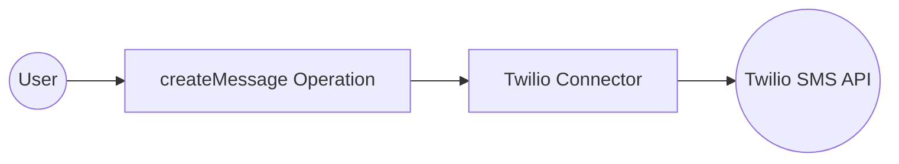

# Example

## What you'll build

Build a Twilio SMS integration using the WSO2 Integrator low-code UI. The integration configures the Twilio connector with secure configurable credentials and calls the `createMessage` operation to send an SMS message.

**Operations used:**
- **createMessage** : Sends an SMS message by specifying a recipient number, sender number, and message body.

## Architecture

## Prerequisites

- Twilio account with an Account SID and Auth Token

## Setting up the Twilio integration

> **New to WSO2 Integrator?** Follow the [Create a New Integration](../../../../develop/create-integrations/create-new-integration.md) guide to set up your integration first, then return here to add the connector.

## Adding the Twilio connector

### Step 1: Open the Add connection panel

Select **Add Connection** (the `+` icon next to **Connections**) in the WSO2 Integrator panel to open the connector palette.

### Step 2: Select the Twilio connector

Search for "twilio" in the palette, then select **Twilio** from the search results to open the **Configure Twilio** form.

## Configuring the Twilio connection

### Step 3: Fill in connection parameters

Enter the connection parameters, binding each to a configurable variable to keep credentials out of source code:

- **accountSid** : Twilio Account SID, bound to a `string` configurable variable
- **authToken** : Twilio Auth Token, bound to a `string` configurable variable
- **connectionName** : Name for this connection instance (for example, `twilioClient`)

### Step 4: Save the connection

Select **Save Connection** to persist the connection. The `twilioClient` connection appears in the **Connections** panel and on the design canvas.

### Step 5: Set actual values for your configurables

In the left panel, select **Configurations** to open the Configurations panel. Set a value for each configurable listed below:

- **accountSid** (string) : Your Twilio Account SID (for example, `ACxxxxxxxxxxxxxxxxxxxxxxxxxxxxxxxx`)
- **authToken** (string) : Your Twilio Auth Token

## Configuring the Twilio createMessage operation

### Step 6: Add an Automation entry point

In the integration overview, select **+ Add Artifact**, then select **Automation** from the artifact type list, and select **Create**. A new automation named `main` is added under **Entry Points** and the flow editor opens.

### Step 7: Select and configure the createMessage operation

In the Automation flow editor, select the **+** button between **Start** and **Error Handler** to open the node panel. Expand **twilioClient** under **Connections** to reveal available operations.

Select **Create Message** from the **Message** group to open the **twilioClient → createMessage** configuration form. Enter the following values in the **Payload** field:

- **To** : Recipient phone number in E.164 format
- **From** : Your Twilio-provisioned sender number
- **Body** : The SMS message text
- **Result** : Auto-named result variable (`twilioMessage`) of type `twilio:Message`

Select **Save**. The `twilio : createMessage` node appears in the automation flow.

## Try it yourself

Try this sample in WSO2 Integration Platform.

[View source on GitHub](https://github.com/wso2/integration-samples/tree/main/connectors/twilio_connector_sample)

## More code examples

The Twilio connector comes equipped with examples that demonstrate its usage across various scenarios. These examples are conveniently organized into three distinct groups based on the functionalities they showcase. For a more hands-on experience and a deeper understanding of these capabilities, we encourage you to experiment with the provided examples in your development environment.

1. Account management
    - [Create a sub-account](https://github.com/ballerina-platform/module-ballerinax-twilio/tree/master/examples/accounts/create-sub-account) - Create a subaccount under a Twilio account
    - [Fetch an account](https://github.com/ballerina-platform/module-ballerinax-twilio/tree/master/examples/accounts/fetch-account) - Get details of a Twilio account
    - [Fetch balance](https://github.com/ballerina-platform/module-ballerinax-twilio/tree/master/examples/accounts/fetch-balance) - Get the balance of a Twilio account
    - [List accounts](https://github.com/ballerina-platform/module-ballerinax-twilio/tree/master/examples/accounts/list-accounts) - List all subaccounts under a Twilio account
    - [Update an account](https://github.com/ballerina-platform/module-ballerinax-twilio/tree/master/examples/accounts/update-account) - Update the name of a Twilio account
2. Call management
    - [Make a call](https://github.com/ballerina-platform/module-ballerinax-twilio/tree/master/examples/calls/create-call) - Make a call to a phone number via a Twilio
    - [Fetch call log](https://github.com/ballerina-platform/module-ballerinax-twilio/tree/master/examples/calls/fetch-call-log) - Get details of a call made via a Twilio
    - [List call logs](https://github.com/ballerina-platform/module-ballerinax-twilio/tree/master/examples/calls/list-call-logs) - Get details of all calls made via a Twilio
    - [Delete a call log](https://github.com/ballerina-platform/module-ballerinax-twilio/tree/master/examples/calls/delete-call-log) - Delete the log of a call made via Twilio
3. Message management
    - [Send an SMS message](https://github.com/ballerina-platform/module-ballerinax-twilio/tree/master/examples/messages/create-sms-message) - Send an SMS to a phone number via a Twilio
    - [Send a Whatsapp message](https://github.com/ballerina-platform/module-ballerinax-twilio/tree/master/examples/messages/create-whatsapp-message) - Send a Whatsapp message to a phone number via a Twilio
    - [List message logs](https://github.com/ballerina-platform/module-ballerinax-twilio/tree/master/examples/messages/list-message-logs) - Get details of all messages sent via a Twilio
    - [Fetch a message log](https://github.com/ballerina-platform/module-ballerinax-twilio/tree/master/examples/messages/fetch-message-log) - Get details of a message sent via a Twilio
    - [Delete a message log](https://github.com/ballerina-platform/module-ballerinax-twilio/tree/master/examples/messages/delete-message-log) - Delete a message log via a Twilio
