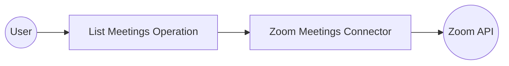

# Example

## What you'll build

Build an integration that authenticates with Zoom via OAuth 2.0 and retrieves a list of meetings for the authenticated user. The integration uses the Zoom Meetings connector to call the `listMeetings` operation and stores the result in a variable for further processing.

**Operations used:**
- **listMeetings** : Retrieves all meetings for the authenticated Zoom user

## Architecture

## Prerequisites

- A Zoom account with an OAuth app configured in the Zoom Marketplace developer portal
- Zoom OAuth 2.0 credentials: Client ID, Client Secret, and Refresh Token

## Setting up the Zoom Meetings integration

> **New to WSO2 Integrator?** Follow the [Create a New Integration](../../../../develop/create-integrations/create-new-integration.md) guide to set up your integration first, then return here to add the connector.

## Adding the Zoom Meetings connector

### Step 1: Open the connector palette

In the project tree, hover over **Connections** and select the **+** (Add Connection) button to open the **Add Connection** palette.

### Step 2: Search for and select the Zoom Meetings connector

1. In the search field at the top of the palette, enter `zoom`.
2. Locate **Meetings** (package `ballerinax/zoom.meetings`).
3. Select the connector card to open the **Configure Meetings** form.

## Configuring the Zoom Meetings connection

### Step 3: Fill in the connection parameters

Bind all authentication fields to configurable variables so credentials are never hard-coded. In the **Configure Meetings** form, ensure the **Config** field is in **Expression** mode, then enter the following expression:

`{auth: {clientId: zoomClientId, clientSecret: zoomClientSecret, refreshToken: zoomRefreshToken, refreshUrl: zoomRefreshUrl}}`

- **auth.clientId** : The OAuth app's client ID, bound to the `zoomClientId` configurable variable
- **auth.clientSecret** : The OAuth app's client secret, bound to the `zoomClientSecret` configurable variable
- **auth.refreshToken** : The long-lived refresh token, bound to the `zoomRefreshToken` configurable variable
- **auth.refreshUrl** : The Zoom token endpoint URL, bound to the `zoomRefreshUrl` configurable variable

### Step 4: Save the connection

Select **Save Connection** to persist the connection. The **meetingsClient** node appears on the design canvas confirming the connection was created.

### Step 5: Set actual values for your configurables

1. In the left panel, select **Configurations**.
2. Set a value for each configurable listed below.

- **zoomClientId** (string) : Your Zoom OAuth app's client ID from the Zoom Marketplace developer portal
- **zoomClientSecret** (string) : Your Zoom OAuth app's client secret from the Zoom Marketplace developer portal
- **zoomRefreshToken** (string) : The refresh token obtained via the Zoom OAuth authorization flow
- **zoomRefreshUrl** (string) : The Zoom token endpoint, for example `https://zoom.us/oauth/token`
- **zoomServiceUrl** (string) : The Zoom API base URL, for example `https://api.zoom.us/v2`

## Configuring the Zoom Meetings listMeetings operation

### Step 6: Add an Automation entry point

1. On the integration canvas, select **+ Add Artifact**.
2. Under **Automation**, select the **Automation** tile.
3. Select **Create** to open the automation flow editor.

### Step 7: Select and configure the listMeetings operation

1. Select the **+** button between **Start** and **Error Handler** to add a new step.
2. Under **Connections** in the node panel, expand **meetingsClient** to reveal all available operations.

3. Select **List meetings** to open its configuration panel.
4. Fill in the operation fields:

- **userId** : Enter `me` to return meetings for the currently authenticated user
- **result** : Enter `meetingsList` as the variable name to hold the response

5. Select **Save** to add the step to the flow canvas.

## Try it yourself

Try this sample in WSO2 Integration Platform.

[View source on GitHub](https://github.com/wso2/integration-samples/tree/main/connectors/zoom_meetings_connector_sample)

## More code examples

The `Zoom Meetings` connector provides practical examples illustrating usage in various scenarios. Explore these [examples](https://github.com/ballerina-platform/module-ballerinax-zoom.meetings/tree/main/examples/), covering the following use cases:

1. [**Create a Zoom meeting**](https://github.com/ballerina-platform/module-ballerinax-zoom.meetings/tree/main/examples/create-new-meeting) – Creates a new Zoom meeting using the API.

2. [**List scheduled meetings**](https://github.com/ballerina-platform/module-ballerinax-zoom.meetings/tree/main/examples/list-all-meetings) – Displays the list of meetings scheduled under a specified Zoom user account.
