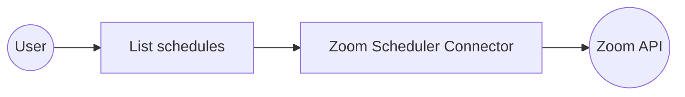

# Example

## What you'll build

Build a WSO2 Integrator automation that authenticates with Zoom via OAuth2 and retrieves all booking schedules for the authenticated user. The integration uses the Zoom Scheduler connector to call the List schedules operation and stores the paginated response for further processing.

**Operations used:**
- **List schedules** : Retrieves all booking schedules for the authenticated Zoom user

## Architecture

## Prerequisites

- Zoom OAuth2 credentials: `clientId`, `clientSecret`, `refreshToken`, and `refreshUrl` from a Zoom OAuth app

## Setting up the Zoom Scheduler integration

> **New to WSO2 Integrator?** Follow the [Create a New Integration](../../../../develop/create-integrations/create-new-integration.md) guide to set up your integration first, then return here to add the connector.

## Adding the Zoom Scheduler connector

### Step 1: Open the Add connection palette

In the project tree, expand your project and select the **+** icon next to **Connections** to open the **Add Connection** palette.

## Configuring the Zoom Scheduler connection

### Step 2: Fill in the connection parameters

Search for **zoom** in the palette, then select **Scheduler** to open the **Configure Scheduler** form. Toggle the **Config** field to **Expression** mode and enter the OAuth2 record expression. Set the following parameters, each bound to a configurable variable:

- **auth.refreshUrl** : Zoom OAuth2 token refresh URL
- **auth.refreshToken** : OAuth2 refresh token for the Zoom account
- **auth.clientId** : OAuth2 client ID from the Zoom app
- **auth.clientSecret** : OAuth2 client secret from the Zoom app
- **connectionName** : Set to `zoomSchedulerClient`

> **Note:** The **Config** field must be in **Expression** mode—not Record mode—when entering the `{auth: {...}}` record constructor. Record mode wraps the value in string quotes, causing a type mismatch error.

### Step 3: Save the connection

Select **Save Connection** to persist the configuration. The designer returns to the main canvas and displays the `zoomSchedulerClient` connection node. Confirm the entry appears under **Connections** in the project tree.

### Step 4: Set actual values for your configurables

1. In the left panel, select **Configurations**.
2. Set a value for each configurable listed below.

- **zoomRefreshUrl** (string) : The Zoom OAuth2 token endpoint, e.g., `https://zoom.us/oauth/token`
- **zoomRefreshToken** (string) : Your Zoom OAuth2 refresh token
- **zoomClientId** (string) : Your Zoom OAuth2 client ID
- **zoomClientSecret** (string) : Your Zoom OAuth2 client secret

## Configuring the Zoom Scheduler List schedules operation

### Step 5: Add and configure the List schedules operation

1. Under **Entry Points**, select **main** (or create a new Automation via **Add Artifact → Automation**).
2. On the canvas, expand the **Connections** section in the node panel and select **zoomSchedulerClient** to reveal the available operations.

Select **List schedules** from the operations panel. The configuration form opens with no required parameters. The **Result** field is pre-filled with `schedulerInlineresponse2005`, which will hold the paginated list of Zoom booking schedules returned by the API. Select **Save** to insert the operation into the automation flow.

- **result** : Variable name that stores the list of booking schedules returned by the API

## Try it yourself

Try this sample in WSO2 Integration Platform.

[View source on GitHub](https://github.com/wso2/integration-samples/tree/main/connectors/zoom.scheduler_connector_sample)

## More code examples

The `Zoom Scheduler` connector provides practical examples illustrating usage in various scenarios. Explore these [examples](https://github.com/ballerina-platform/module-ballerinax-zoom.scheduler/tree/main/examples/), covering the following use cases:

1. **[Meeting Scheduler](https://github.com/ballerina-platform/module-ballerinax-zoom.scheduler/tree/main/examples/meeting-scheduler)** - Create scheduled meetings, generate single-use scheduling links, and manage team meeting schedules with automated booking capabilities.

2. **[Availability Manager](https://github.com/ballerina-platform/module-ballerinax-zoom.scheduler/tree/main/examples/availability-manager)** - Configure availability schedules, analyze scheduler analytics, and manage working hours for different time zones and business requirements.
