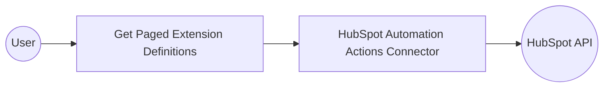

# Example

## What you'll build

Build an integration that retrieves paged extension definitions from the HubSpot Automation Actions API and logs the result as a JSON string. The integration uses token-based authentication via a configurable variable to connect securely to HubSpot.

**Operations used:**
- **Get paged extension definitions** : Retrieves a paged list of automation action extension definitions from HubSpot

## Architecture

## Prerequisites

- A valid [HubSpot](https://www.hubspot.com/) account with API access
- A HubSpot private app token with the required scopes for Automation Actions

## Setting up the HubSpot Automation Actions integration

> **New to WSO2 Integrator?** Follow the [Create a New Integration](../../../../develop/create-integrations/create-a-new-integration.md) guide to set up your integration first, then return here to add the connector.

## Adding the HubSpot Automation Actions connector

### Step 1: Add the HubSpot Automation Actions connector from the palette

In the design canvas, open the connector palette and search for the HubSpot Automation Actions connector.

1. In the design canvas, navigate to the **Connections** section.
2. Select the **Add Connection** button to open the connector palette.
3. In the search field, enter `hubspot.automation.actions` to filter the list.
4. Locate **Actions** under `ballerinax / hubspot.automation.actions` and select the connector card.

## Configuring the HubSpot Automation Actions connection

### Step 2: Fill in the connection parameters

Configure the connection by binding the authentication token to a configurable variable.

1. Set the **Connection Name** to `actionsClient`.
2. For the **Config** field, switch to **Expression** mode and enter `{auth: {token: hubspotAuthToken}}` to reference the configurable token variable.

### Step 3: Save the connection

Select **Save** to persist the connection. The `actionsClient` connection now appears in the **Connections** panel on the canvas.

### Step 4: Set actual values for your configurables

In the left panel, select **Configurations** and set a value for each configurable listed below.

- **hubspotAuthToken** (string) : Your HubSpot private app token for authenticating API requests

## Configuring the HubSpot Automation Actions Get paged extension definitions operation

### Step 5: Add an automation entry point

Select **Add Artifact** in the WSO2 Integrator sidebar and select **Automation** from the artifact selection panel. An Automation entry point named `main` is created and the flow canvas opens, showing **Start** and **Error Handler** nodes.

### Step 6: Select and configure the Get paged extension definitions operation

Select the **+** button on the flow line between **Start** and **Error Handler** to open the node panel. Under **Connections**, expand `actionsClient` to view available operations, then select **Get paged extension definitions**.

Configure the operation parameters:

- **AppId** : Your HubSpot application ID (enter `0` if not using a specific app)
- **Result** : Variable name to store the operation result, set to `result`

Select **Save** to add the operation to the flow.

## Try it yourself

Try this sample in WSO2 Integration Platform.

[View source on GitHub](https://github.com/wso2/integration-samples/tree/main/connectors/hubspot.automation.actions_connector_sample)

## More code examples

The `HubSpot Automation API` connector provides practical examples illustrating usage in various scenarios. Explore these [examples](https://github.com/ballerina-platform/module-ballerinax-hubspot.automation.actions/tree/main/examples/), covering the following use cases:

1. [Extension CRUD](https://github.com/ballerina-platform/module-ballerinax-hubspot.automation.actions/tree/main/examples/extension-crud) - Perform CRUD operations on extensions.
2. [Call complete callback APIs](https://github.com/ballerina-platform/module-ballerinax-hubspot.automation.actions/tree/main/examples/callback-completion) - Complete callbacks using the HubSpot API.
