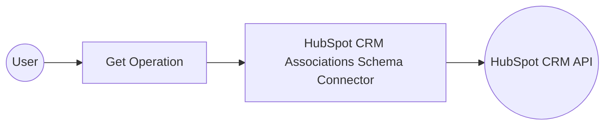

# Example

## What you'll build

Build a simple integration that retrieves all association definitions and configurations from HubSpot CRM and logs the result. The integration connects to the HubSpot CRM Associations Schema API using a private app token and outputs the response as a JSON string.

**Operations used:**
- **get** : Retrieves all association definitions and configurations from HubSpot CRM.

## Architecture

## Prerequisites

- A HubSpot account with API access
- A HubSpot private app token with CRM scopes

## Setting up the HubSpot CRM Associations Schema integration

> **New to WSO2 Integrator?** Follow the [Create a New Integration](../../../../develop/create-integrations/create-new-integration.md) guide to set up your integration first, then return here to add the connector.

## Adding the HubSpot CRM Associations Schema connector

### Step 1: Open the connector palette

In the WSO2 Integrator sidebar, hover over **Connections** and select the **Add Connection** (**+**) button to open the connector palette.

## Configuring the HubSpot CRM Associations Schema connection

### Step 2: Fill in the connection parameters

Search for `hubspot.crm.associations.schema` in the palette, select the **Schema** connector card to open the **Configure Schema** connection form, and bind each field to a configurable variable:

- **Config** : Authentication configuration record containing the auth token, bound to a configurable expression using `hubspotAuthToken`
- **Service Url** : URL of the target service, bound to the configurable variable `hubspotServiceUrl`
- **Connection Name** : Name identifier for this connection

### Step 3: Save the connection

Select **Save Connection** to persist the connection. Confirm that `schemaClient` appears in the **Connections** panel.

### Step 4: Set actual values for your configurables

1. In the left panel, select **Configurations**.
2. Set a value for each configurable listed below.

- **hubspotAuthToken** (string) : Your HubSpot private app token with CRM scopes
- **hubspotServiceUrl** (string) : The HubSpot CRM associations API base URL (e.g., `https://api.hubapi.com/crm/v4/associations`)

## Configuring the HubSpot CRM Associations Schema get operation

### Step 5: Add an Automation entry point

In the WSO2 Integrator sidebar, hover over **Entry Points**, select the **Add Entry Point** (**+**) button, select **Automation** from the panel, and select **Create** to add the `main` automation entry point.

### Step 6: Select and configure the get operation

In the automation flow canvas, select the **+** button after the **Start** node to open the node panel. Under **Connections**, expand **schemaClient** to see all available operations.

Select **Retrieve all association definitions and configurations** (the `get` operation) and configure its parameters:

- **Result** : Set the result variable name to `result`

Select **Save**.

## Try it yourself

Try this sample in WSO2 Integration Platform.

[View source on GitHub](https://github.com/wso2/integration-samples/tree/main/connectors/hubspot.crm.associations.schema_connector_sample)

## More code examples

The `HubSpot CRM Associations schema` connector provides practical examples illustrating usage in various scenarios. Explore these [examples](https://github.com/ballerina-platform/module-ballerinax-hubspot.crm.associations.schema/tree/main/examples), covering the following use cases.

1. [Association definition analytics report](https://github.com/ballerina-platform/module-ballerinax-hubspot.crm.associations.schema/tree/main/examples/association_analytics_report) : Analyzes association definition configurations between object types (e.g., `contacts` to `deals`) in HubSpot, categorizing them and generating a count-based report.

2. [Automated association definition configuration update](https://github.com/ballerina-platform/module-ballerinax-hubspot.crm.associations.schema/tree/main/examples/automated_configuration_update) : Manages Doctor-Patient associations by updating them dynamically based on status changes (`Pandemic`, `Emergency`, `Normal`, or `Special`).

3. [Association definition management](https://github.com/ballerina-platform/module-ballerinax-hubspot.crm.associations.schema/tree/main/examples/companies_association_management) : Creates and manages custom associations (`Headquarters-Franchise`) between two `companies` objects, including reading, updating, and deleting associations.
