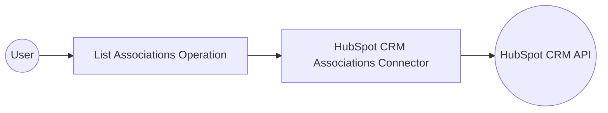

# Example

## What you'll build

Build an integration that retrieves associations between CRM objects (contacts and companies) using the HubSpot CRM Associations connector. The integration queries the HubSpot CRM Associations API and logs the results.

**Operations used:**
- **List Associations of an Object by Type** : Retrieves all associations for a given source object and target object type

## Architecture

## Prerequisites

- A HubSpot developer account with a valid API bearer token

## Setting up the HubSpot CRM Associations integration

> **New to WSO2 Integrator?** Follow the [Create a New Integration](../../../../develop/create-integrations/create-a-new-integration.md) guide to set up your integration first, then return here to add the connector.

## Adding the HubSpot CRM Associations connector

### Step 1: Open the Add Connection panel

Select the **+** button next to **Connections** to open the Add Connection palette.

## Configuring the HubSpot CRM Associations connection

### Step 2: Fill in the connection parameters

Enter the connection parameters, binding each field to a configurable variable:

- **connectionName** : Enter `associationsClient` as the connection name
- **config** : Switch to **Expression** mode and enter `{auth: {token: hubspotAuthToken}}` to bind the auth token to a configurable variable

### Step 3: Save the connection

Select **Save** to create the connection. The `associationsClient` connection appears in the project tree under **Connections** and on the design canvas.

### Step 4: Set actual values for your configurables

1. In the left panel, select **Configurations**.
2. Set a value for each configurable listed below.

- **hubspotAuthToken** (string) : Your HubSpot API bearer token

## Configuring the HubSpot CRM Associations List Associations of an Object by Type operation

### Step 5: Add an Automation entry point

Select **Add Artifact** in the WSO2 Integrator panel, then select **Automation** as the entry point type. Name it `main` and select **Create**. The Automation flow appears on the canvas with **Start** and **Error Handler** nodes.

### Step 6: Select the operation and configure its parameters

1. Select the **+** (Add Step) button on the flow between the **Start** node and the **Error Handler**.
2. Under **Connections**, expand the `associationsClient` connection to reveal available operations.

3. Select **List Associations of an Object by Type** and fill in the required fields:

- **objectType** : The source object type (for example, `contacts`)
- **objectId** : The ID of the source object
- **toObjectType** : The target association object type (for example, `companies`)
- **result** : The variable name for the response

Select **Save** to add the operation to the flow.

## Try it yourself

Try this sample in WSO2 Integration Platform.

[View source on GitHub](https://github.com/wso2/integration-samples/tree/main/connectors/hubspot.crm.associations_connector_sample)

## More code examples

The `HubSpot CRM Associations` connector provides practical examples illustrating usage in various scenarios. Explore these [examples](https://github.com/ballerina-platform/module-ballerinax-hubspot.crm.associations/tree/main/examples), covering the following use cases:

1. [Create and read associations](https://github.com/ballerina-platform/module-ballerinax-hubspot.crm.associations/tree/main/examples/create-read-associations) –  This example demonstrates how to use the HubSpot CRM Associations connector to batch-create default and custom-labeled associations between deals and companies, as well as retrieve existing associations for a given deal.
2. [Create and delete associations](https://github.com/ballerina-platform/module-ballerinax-hubspot.crm.associations/tree/main/examples/create-delete-associations) - This example demonstrates how to use the HubSpot CRM Associations connector to create individual default associations with and without labels between deals and companies. It then shows how to delete a specific association label between them, followed by deleting all associations between the two objects.
