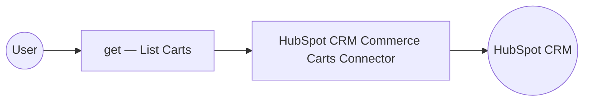

# Example

## What you'll build

This integration demonstrates how to connect WSO2 Integrator to HubSpot's CRM Commerce Carts API using the `ballerinax/hubspot.crm.commerce.carts` connector. The workflow uses an Automation entry point to invoke the `get` operation on the HubSpot Carts API, retrieving cart records with a configurable limit. The complete flow runs as a automation on the WSO2 Integrator canvas, with the connector node, operation step all connected end-to-end.

**Operations used:**
- **get** : Lists all cart objects from the HubSpot CRM Commerce Carts API, returning a paginated collection of cart records with their associated properties.

## Architecture

## Prerequisites

- A HubSpot developer account with API access enabled and a valid private app token or OAuth credentials for the CRM Commerce Carts API.
- The HubSpot CRM Commerce Carts API base URL (typically `https://api.hubapi.com`).

## Setting up the HubSpot CRM Commerce Carts integration

> **New to WSO2 Integrator?** Follow the [Create a New Integration](../../../../develop/create-integrations/create-new-integration.md) guide to set up your integration first, then return here to add the connector.

## Adding the HubSpot CRM Commerce Carts connector

### Step 1: Open the connector palette

Select the **Add Connection** button (or the **+** icon next to the **Connections** label on the canvas) to open the connector search palette.

### Step 2: Search for the HubSpot CRM Commerce Carts connector

Enter `hubspot.crm.commerce.carts` in the search box and select the **ballerinax/hubspot.crm.commerce.carts** connector card when it appears in the results.

## Configuring the HubSpot CRM Commerce Carts connection

### Step 3: Bind connection parameters to configurables

For each field shown in the **Configure HubSpot CRM Commerce Carts** form, navigate to the **Configurables** tab, create a new configurable with a descriptive camelCase name, and save to auto-inject it into the field.
- **Config** : The connection configuration record containing the authentication credentials, using a configurable variable for the HubSpot private app token.

### Step 4: Save the connection

Select **Save** to persist the HubSpot CRM Commerce Carts connection. The connector node named `cartsClient` appears on the integration design canvas under **Connections**.

### Step 5: Set actual values for your configurables

In the left panel of WSO2 Integrator, select **Configurations** (listed at the bottom of the project tree, under Data Mappers) to open the Configurations panel, then set a value for each configurable:
- **hubspotAuthToken** (string) : Your HubSpot private app token with CRM Commerce Carts API access permissions.

## Configuring the HubSpot CRM Commerce Carts get operation

### Step 6: Add an automation entry point

1. In the left sidebar, hover over **Entry Points** and select **Add Entry Point** (or select **+ Add Automation** on the canvas).
2. Select **Automation** in the artifact selection panel.
3. Accept the default trigger settings and select **Create** to add the automation to the canvas.

### Step 7: Select and configure the get operation

1. Inside the automation body, select the **+** (Add Step) button on the edge between the **Start** node and the **Error Handler** node.
2. Under **Connections** in the node panel, select the HubSpot CRM Commerce Carts connection node (`cartsClient`) to expand it and reveal all available operations.

3. Select **get** from the operations list, then fill in the operation fields:
- **Limit** : The maximum number of cart records to return per page.
- **Result Variable** : The variable name to store the API response.
4. Select **Save** to add the operation step to the automation flow.

### Step 8: Log the get result

1. Hover the **carts : get** node on the canvas to reveal the **+** (Add Step) button on the connector edge below it, then select it.
2. Expand **Logging** and select **Log Info**.
3. Set the **Msg** field to `Carts listing completed` in Text mode to log a confirmation message after the cart listing operation completes.
4. Select **Save** to add the Log step to the flow.

## Try it yourself

Try this sample in WSO2 Integration Platform.

[View source on GitHub](https://github.com/wso2/integration-samples/tree/main/connectors/hubspot.crm.commerce.carts_connector_sample)

## More code examples

The `HubSpot CRM Commerce Carts` connector provides practical examples illustrating usage in various scenarios. Explore these [examples](https://github.com/ballerina-platform/module-ballerinax-hubspot.crm.commerce.carts/tree/main/examples/), covering the following use cases:

1. [Single Cart Management](https://github.com/ballerina-platform/module-ballerinax-hubspot.crm.commerce.carts/tree/main/examples/carts/) - Create, retrieve, update, search, and delete a single cart for a customer.
2. [Batch of Carts Management](https://github.com/ballerina-platform/module-ballerinax-hubspot.crm.commerce.carts/tree/main/examples/batch-of-carts) - Create, retrieve, update, and archive a batch of carts for customers.
