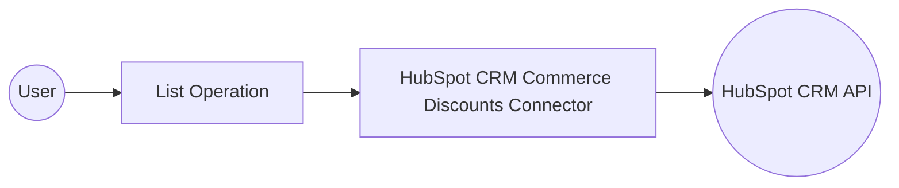

# Example

## What you'll build

Build a WSO2 Integrator automation that connects to the HubSpot CRM Commerce Discounts API and retrieves all discount objects. The integration uses an Automation entry point to call the List operation and logs the results as JSON.

**Operations used:**
- **List** : Retrieves all discount objects from your HubSpot CRM account

## Architecture

## Prerequisites

- A HubSpot account with API access
- A HubSpot private app token with CRM scopes for commerce discounts

## Setting up the HubSpot CRM Commerce Discounts integration

> **New to WSO2 Integrator?** Follow the [Create a New Integration](../../../../develop/create-integrations/create-a-new-integration.md) guide to set up your integration first, then return here to add the connector.

## Adding the HubSpot CRM Commerce Discounts connector

### Step 1: Open the connector palette and search for the HubSpot CRM Commerce Discounts connector

1. In the Design view, select **Add Artifact** and select **Connection**.
2. The connector palette opens. Use the search field to find the connector.

3. Search for `hubspot.crm.commerce.discounts` in the search field.
4. Select the **HubSpot CRM Commerce Discounts** connector from the results.

## Configuring the HubSpot CRM Commerce Discounts connection

### Step 2: Fill in the connection parameters and save the connection

Bind each field to a configurable variable so credentials stay out of your source code.

- **Connection Name** : Enter `discountsClient`
- **Config** : Reference a configurable variable `hubspotAuthToken` that holds your HubSpot API token
- **Service Url** : Reference a configurable variable `hubspotServiceUrl` for the API base URL

Select **Save** to create the connection.

### Step 3: Set actual values for your configurables

1. In the left panel, select **Configurations**.
2. Set a value for each configurable listed below.

- **hubspotServiceUrl** (string) : The base URL for the HubSpot Commerce Discounts API
- **hubspotAuthToken** (string) : Your HubSpot private app API token

## Configuring the HubSpot CRM Commerce Discounts List operation

### Step 4: Add an Automation entry point

1. Select **Add Artifact** in the Design section.
2. Select **Automation** from the artifacts list.
3. Select **Create** to add the automation entry point.

### Step 5: Select the List operation and configure it

1. In the Automation flow canvas, select the **+** button after the **Start** node to open the step panel.
2. Expand the **discountsClient** connection under the **Connections** section to see available operations.

3. Select the **List** operation.
4. The operation configuration form appears. This operation has no required parameters. Set the **Result** variable name to `listResult`.
5. Select **Save**.

## Try it yourself

Try this sample in WSO2 Integration Platform.

[View source on GitHub](https://github.com/wso2/integration-samples/tree/main/connectors/hubspot.crm.commerce.discounts_connector_sample)

## More code examples

The HubSpot CRM Commerce Discounts connector provides practical examples illustrating usage in various scenarios. Explore these [examples](https://github.com/ballerina-platform/module-ballerinax-hubspot.crm.commerce.discounts/tree/main/examples/), covering the following use cases:

1. [Discount Manager](https://github.com/ballerina-platform/module-ballerinax-hubspot.crm.commerce.discounts/tree/main/examples/discount_manager) - see how the HubSpot API can be used to create discount and manage it through endpoints.
2. [Festival Discounts](https://github.com/ballerina-platform/module-ballerinax-hubspot.crm.commerce.discounts/tree/main/examples/festival_discounts) - see how the HubSpot API can be used to create and to manage multiple discounts at a time.
