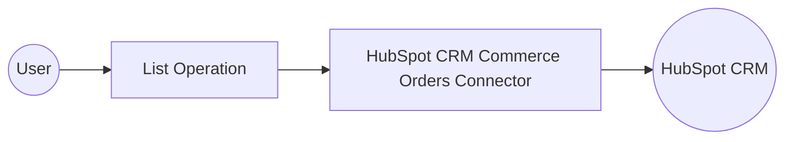

# Example

## What you'll build

Build a WSO2 Integrator automation that connects to the HubSpot CRM Commerce Orders API, retrieves all orders from your HubSpot account, and logs the results as a JSON string.

**Operations used:**
- **List** : Retrieves all commerce orders from your HubSpot CRM account

## Architecture

## Prerequisites

- A HubSpot account with API access
- A valid HubSpot authentication token

## Setting up the HubSpot CRM Commerce Orders integration

> **New to WSO2 Integrator?** Follow the [Create a New Integration](../../../../develop/create-integrations/create-new-integration.md) guide to set up your integration first, then return here to add the connector.

## Adding the HubSpot CRM Commerce Orders connector

### Step 1: Open the Add Connection panel

Select the **+** button on the flow connection line to open the **Node Panel**, then expand the **Connections** section and select the **+** (Add Connection) button.

## Configuring the HubSpot CRM Commerce Orders connection

### Step 2: Fill in the connection parameters

Search for **hubspot.crm.commerce.orders** in the palette and select the **ballerinax/hubspot.crm.commerce.orders** connector card to open the **New Connection** form. Set the **Config** field to Expression mode and bind each parameter to a configurable variable:

- **auth.token** : The HubSpot API authentication token, bound to the `hubspotAuthToken` configurable variable
- **Connection Name** : Set to `ordersClient`

### Step 3: Save the connection

Select **Save** to create the connection. The `ordersClient` connection appears in the **Connections** section of the left sidebar.

### Step 4: Set actual values for your configurables

1. In the left panel, select **Configurations**.
2. Set a value for each configurable listed below.

- **hubspotAuthToken** (string) : Your HubSpot API authentication token

## Configuring the HubSpot CRM Commerce Orders List operation

### Step 5: Select and configure the List operation

Select the **+** button on the flow connection line to open the **Node Panel**, then expand the **ordersClient** connection to reveal all available operations.

Select **List** to open the operation configuration form. The operation has no required parameters. In the **Result** field, enter `result`, then select **Save**.

- **Result** : Variable name used to store the list of orders returned by the API

## Try it yourself

Try this sample in WSO2 Integration Platform.

[View source on GitHub](https://github.com/wso2/integration-samples/tree/main/connectors/hubspot.crm.commerce.orders_connector_sample)

## More code examples

The `HubSpot CRM Commerce Orders` connector provides practical examples illustrating usage in various scenarios. Explore these [examples](https://github.com/ballerina-platform/module-ballerinax-hubspot.crm.commerce.orders/tree/main/examples/), covering the following use cases:

1. [Batch Operations](https://github.com/ballerina-platform/module-ballerinax-hubspot.crm.commerce.orders/tree/main/examples/batch-operations) - Perform Batch operations on Orders in HubSpot
2. [Order Management](https://github.com/ballerina-platform/module-ballerinax-hubspot.crm.commerce.orders/tree/main/examples/order-management) - Perform CRUD operations on Orders in HubSpot
3. [Search Operation](https://github.com/ballerina-platform/module-ballerinax-hubspot.crm.commerce.orders/tree/main/examples/search-operation) - Perform Search operations on Orders in HubSpot
