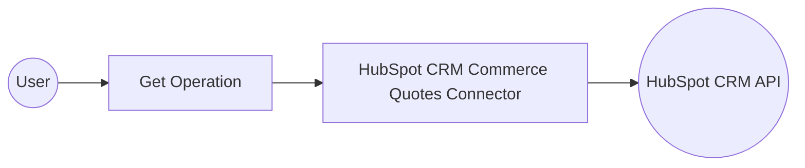

# Example

## What you'll build

Build a WSO2 Integrator automation that connects to the HubSpot CRM Commerce Quotes API and retrieves a list of quotes from HubSpot. The integration logs the retrieved quotes as a JSON string for review.

**Operations used:**
- **get** : Retrieves a page of quotes from HubSpot CRM and stores the result in a configurable variable

## Architecture

## Prerequisites

- A HubSpot account with API access
- A HubSpot API token with CRM quotes permissions

## Setting up the HubSpot CRM Commerce Quotes integration

> **New to WSO2 Integrator?** Follow the [Create a New Integration](../../../../develop/create-integrations/create-a-new-integration.md) guide to set up your integration first, then return here to add the connector.

## Adding the HubSpot CRM Commerce Quotes connector

### Step 1: Open the flow canvas and search for the connector

Select **Entry Points > main** to open the low-code flow canvas, then select the **+** button below the **Start** node to open the node panel. Select **Show More Functions** and search for `hubspot.crm.commerce.quotes` to locate the **ballerinax/hubspot.crm.commerce.quotes** connector.

## Configuring the HubSpot CRM Commerce Quotes connection

### Step 2: Fill in connection parameters

After selecting the connector, a **New Connection** form appears. Bind each field to a configurable variable:

- **Connection Name** : Enter `quotesClient` as the connection name
- **Service Url** : Bind to a new configurable variable `hubspotQuotesServiceUrl` of type `string`
- **Config** : Switch to **Expression** mode and enter `{auth: {token: hubspotQuotesToken}}`, binding `hubspotQuotesToken` as a new `string` configurable variable

### Step 3: Save the connection

Select **Save** to create the connection. The `quotesClient` connection now appears in the **Connections** section of the sidebar and as a badge on the canvas.

### Step 4: Set actual values for your configurables

1. In the left panel, select **Configurations**.
2. Set a value for each configurable listed below.

- **hubspotQuotesServiceUrl** (string) : The base URL for the HubSpot API, for example `https://api.hubapi.com`
- **hubspotQuotesToken** (string) : Your HubSpot API token with CRM quotes permissions

## Configuring the HubSpot CRM Commerce Quotes get operation

### Step 5: Expand the connection node to view available operations

Select the **+** button on the flow canvas to open the node panel, then expand the **quotesClient** connection section to see available operations.

### Step 6: Select the get operation and configure its parameters

Select the **get** (List) operation to open its configuration form, then fill in the following:

- **Variable Name** : Enter `result` as the variable name to store the retrieved quotes
- **Variable Type** : Auto-populated as `quotes:CollectionResponseSimplePublicObjectWithAssociationsForwardPaging`

Select **Save** to add the operation to the flow.

## Try it yourself

Try this sample in WSO2 Integration Platform.

[View source on GitHub](https://github.com/wso2/integration-samples/tree/main/connectors/hubspot.crm.commerce.quotes_connector_sample)

## More code examples

The `HubSpot CRM Commerce Quotes` connector provides practical examples illustrating usage in various scenarios. Explore these [examples](https://github.com/ballerina-platform/module-ballerinax-hubspot.crm.commerce.quotes/tree/main/examples/), covering the following use cases:

1. [Sales Analytics System](https://github.com/ballerina-platform/module-ballerinax-hubspot.crm.commerce.quotes/tree/main/examples/sales-analytics) - A store can insert their quotes to the system, and system record and analyses the details on the quotes.
