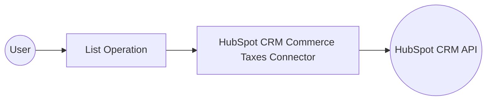

# Example

## What you'll build

Build a WSO2 Integrator automation that connects to the HubSpot CRM Commerce Taxes API and retrieves all tax records from your HubSpot account. The integration uses an Automation entry point to call the List operation and logs a confirmation message on success.

**Operations used:**
- **List** : Retrieves all tax records from the HubSpot CRM Commerce Taxes API.

## Architecture

## Prerequisites

- A HubSpot developer account with API access
- A valid HubSpot OAuth token or private app access token

## Setting up the HubSpot CRM Commerce Taxes integration

> **New to WSO2 Integrator?** Follow the [Create a New Integration](../../../../develop/create-integrations/create-new-integration.md) guide to set up your integration first, then return here to add the connector.

## Adding the HubSpot CRM Commerce Taxes connector

Select **Add Connection** in the WSO2 Integrator sidebar to open the connector palette.

### Step 1: Open the connector palette

Select the **+** button next to **Connections** in the sidebar to open the connector palette.

## Configuring the HubSpot CRM Commerce Taxes connection

### Step 2: Fill in the connection parameters

Enter the connection details and bind each field to a configurable variable.

- **Connection Name** : The name used to identify this connection in the integration
- **Config** : Authentication configuration referencing `hubspotAuthToken` as the OAuth token
- **Service Url** : The HubSpot API base URL, referencing `hubspotServiceUrl`

### Step 3: Save the connection

Select **Save** to create the connection. The canvas displays the `taxesClient` connection card, confirming the connection was created successfully.

### Step 4: Set actual values for your configurables

In the left panel, select **Configurations** and set a value for each configurable listed below.

- **hubspotAuthToken** (string) : Your HubSpot OAuth access token or private app token
- **hubspotServiceUrl** (string) : The HubSpot API base URL (for example, `https://api.hubapi.com`)

## Configuring the HubSpot CRM Commerce Taxes List operation

### Step 5: Add an Automation entry point

1. Select **Add Artifact** on the design canvas.
2. Select **Automation** from the artifact options.
3. Select **Create** to add the automation entry point.

### Step 6: Select and configure the List operation

Expand **taxesClient** in the **Connections** section of the node panel to view available operations, then select **List** and configure its parameters.

- **Result variable** : Set to `listResult` to store the response containing tax records

Select **Save** to add the operation to the flow.

## Try it yourself

Try this sample in WSO2 Integration Platform.

[View source on GitHub](https://github.com/wso2/integration-samples/tree/main/connectors/hubspot.crm.commerce.taxes_connector_sample)

## More code examples

The `HubSpot CRM Commerce Taxes` connector provides practical examples illustrating usage in various scenarios. Explore these [examples](https://github.com/ballerina-platform/module-ballerinax-hubspot.crm.commerce.taxes/tree/main/examples), covering the following use cases:

1. [Manage Taxes](https://github.com/ballerina-platform/module-ballerinax-hubspot.crm.commerce.taxes/tree/main/examples/manage-taxes/) - see how the Ballerina `hubspot.crm.commerce.taxes` connector can be used to create a tax and manage it through the sales pipeline.
2. [Search Taxes](https://github.com/ballerina-platform/module-ballerinax-hubspot.crm.commerce.taxes/tree/main/examples/search_taxes/) - see how the Ballerina `hubspot.crm.commerce.taxes` connector can be used to search for taxes using properties and create a batch of taxes
