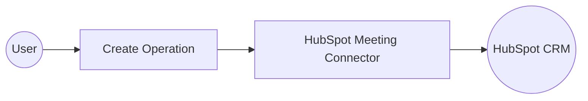

# Example

## What you'll build

Build a WSO2 Integrator automation that creates a new meeting engagement in HubSpot CRM using the HubSpot CRM Engagement Meeting connector. The integration uses an Automation entry point to trigger the operation and logs the API response for verification.

**Operations used:**
- **Create** : Creates a new meeting engagement object in HubSpot CRM via `POST /crm/v3/objects/meetings`

## Architecture

## Prerequisites

- A HubSpot account with a Private App access token (bearer token)

## Setting up the HubSpot CRM Engagement Meeting integration

> **New to WSO2 Integrator?** Follow the [Create a New Integration](../../../../develop/create-integrations/create-new-integration.md) guide to set up your integration first, then return here to add the connector.

## Adding the HubSpot CRM Engagement Meeting connector

Select **Add Connection** in the left sidebar under **Connections** to open the connector palette.

### Step 1: Search for and select the HubSpot Meeting connector

1. Enter `hubspot` in the connector search box.
2. Locate **Meeting** (`ballerinax/hubspot.crm.engagement.meeting`) in the results.
3. Select the connector card to open the **Configure Meeting** connection form.

## Configuring the HubSpot CRM Engagement Meeting connection

### Step 2: Fill in the connection parameters

Bind the connection's **Config** field to a configurable variable so credentials are not hardcoded.

- **Config** : Set to the HubSpot bearer token auth record using a configurable variable for the token value

### Step 3: Save the connection

Select **Save Connection**. The `meetingClient` connection tile now appears on the integration canvas.

### Step 4: Set actual values for your configurables

In the left panel, select **Configurations**. Set a value for each configurable listed below.

- **hubspotAuthToken** (string) : Your HubSpot Private App access token (bearer token)

## Configuring the HubSpot CRM Engagement Meeting Create operation

### Step 5: Add an Automation entry point

1. On the canvas, select **+ Add Artifact**.
2. Select **Automation** from the artifact picker.
3. Select **Create** to confirm.

The flow canvas opens showing a **Start** node, a placeholder step slot, and an **Error Handler**.

### Step 6: Select and configure the Create operation

1. Select the **+** button between **Start** and **Error Handler** to open the step picker.
2. Under **Connections → meetingClient**, expand the connection to see all available operations.

3. Select **Create** (maps to `POST /crm/v3/objects/meetings`).
4. In the operation form, configure the following parameters:
   - **Payload** : Set to the meeting properties record, including `hs_meeting_title`, `hs_timestamp`, and `hs_meeting_outcome`
   - **Result** : Set the result variable name to `result`
5. Select **Save**.

## Try it yourself

Try this sample in WSO2 Integration Platform.

[View source on GitHub](https://github.com/wso2/integration-samples/tree/main/connectors/hubspot.crm.engagement.meeting_connector_sample)

## More code examples

The `HubSpot CRM Engagement Meeting` connector provides practical examples illustrating usage in various scenarios. Explore these [examples](https://github.com/ballerina-platform/module-ballerinax-hubspot.crm.engagement.meeting/tree/main/examples), covering the following use cases:

1. [Meeting_batch](https://github.com/ballerina-platform/module-ballerinax-hubspot.crm.engagement.meeting/tree/main/examples/meeting_batch)
2. [Meeting_for_contacts](https://github.com/ballerina-platform/module-ballerinax-hubspot.crm.engagement.meeting/tree/main/examples/meeting_for_contacts)
