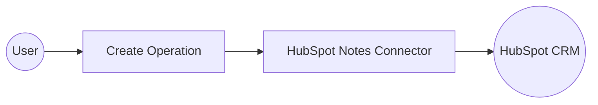

# Example

## What you'll build

Build a WSO2 Integrator automation that connects to HubSpot CRM and creates an engagement note using the `ballerinax/hubspot.crm.engagement.notes` connector. The integration runs as an automation entry point and posts a note with a body and timestamp to HubSpot via a bearer token–authenticated connection.

**Operations used:**
- **Create** : Creates a single CRM engagement note in HubSpot with the specified properties and associations

## Architecture

## Prerequisites

- A HubSpot account with API access
- A HubSpot Private App bearer token with the `crm.objects.notes.write` scope

## Setting up the HubSpot Notes integration

> **New to WSO2 Integrator?** Follow the [Create a New Integration](../../../../develop/create-integrations/create-new-integration.md) guide to set up your integration first, then return here to add the connector.

## Adding the HubSpot Notes connector

### Step 1: Open the Add Connection palette

Select **+** next to **Connections** in the WSO2 Integrator sidebar to open the Add Connection palette.

### Step 2: Add an automation entry point

Select **+ Add Artifact** → **Automation** → **Create**. An `Automation` entry point named `main` is added under **Entry Points** in the sidebar. The canvas switches to the automation flow view showing a **Start** node and an **Error Handler** block.

## Configuring the HubSpot Notes connection

### Step 3: Fill in the connection parameters

Search for **hubspot**, locate the **Notes** connector (`ballerinax/hubspot.crm.engagement.notes`), and select it to open the **Configure Notes** form. Bind each field to a configurable variable:

- **Config** : HubSpot connection configuration with bearer-token auth using the `hubspotToken` configurable variable
- **Connection Name** : Logical name used to reference this connection throughout the integration

### Step 4: Save the connection

Select **Save Connection**. The integration canvas displays the `notesClient` connection card.

### Step 5: Set actual values for your configurables

In the left panel, select **Configurations**. Set a value for each configurable listed below:

- **hubspotToken** (string) : Your HubSpot Private App bearer token with `crm.objects.notes.write` scope

## Configuring the HubSpot Notes Create operation

### Step 6: Select and configure the Create operation

Select **+** between **Start** and **Error Handler** to open the Node Panel. Expand **Connections → notesClient** to list all available operations.

Select **Create** to open the operation form, then fill in the fields:

- **Payload** : The note payload including `associations` and `properties` (set `hs_note_body` and `hs_timestamp` in expression mode)
- **Result** : Variable name to store the returned `SimplePublicObject`

Select **Save**.

## Try it yourself

Try this sample in WSO2 Integration Platform.

[View source on GitHub](https://github.com/wso2/integration-samples/tree/main/connectors/hubspot.crm.engagement.notes_connector_sample)

## More code examples

The `Ballerina HubSpot CRM Engagement Notes Connector` connector provides practical examples illustrating usage in various scenarios. Explore these [examples](https://github.com/ballerina-platform/module-ballerinax-hubspot.crm.engagement.notes/tree/main/examples/), covering the following use cases:

1. [Managing a single note](https://github.com/ballerina-platform/module-ballerinax-hubspot.crm.engagement.notes/tree/main/examples/manage_notes) - Operations on a single note such as creating, updating and deleting, as well as getting a list of available notes and searching for a note by its content.

2. [Working with a batch of notes](https://github.com/ballerina-platform/module-ballerinax-hubspot.crm.engagement.notes/tree/main/examples/manage_notes_batch) - Operations on a batch of notes such as creating, updating and deleting, as well as getting notes by their ID.
