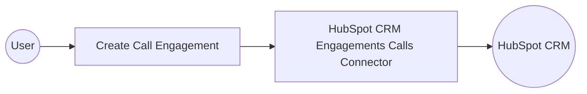

# Example

## What you'll build

This integration demonstrates how to connect to the HubSpot CRM Engagements Calls API using the HubSpot CRM Engagements Calls connector in WSO2 Integrator. The workflow creates a call engagement record in HubSpot CRM using the `post /crm/v3/engagements/calls` operation, populating required call properties such as title, body, duration, and status. The completed integration flow runs as an Automation that invokes the HubSpot connector, logs the returned engagement record, and handles errors gracefully via the built-in Error Handler.

**Operations used:**
- **post /crm/v3/engagements/calls** : Creates a new call engagement record in HubSpot CRM with the specified properties and associations

## Architecture

## Prerequisites

- A HubSpot developer account with an active app and a private app access token that has scopes for `crm.objects.calls.write` and `crm.objects.calls.read`.
- The HubSpot private app access token ready to be used as the connector's auth credential.

## Setting up the HubSpot CRM Engagements Calls integration

> **New to WSO2 Integrator?** Follow the [Create a New Integration](../../../../develop/create-integrations/create-new-integration.md) guide to set up your integration first, then return here to add the connector.

## Adding the HubSpot CRM Engagements Calls connector

### Step 1: Open the Add Connection palette

Select **Add Connection** (or the **+** icon next to the Connections section) in the low-code canvas to open the connector search palette.

### Step 2: Search for and select the HubSpot CRM Engagements Calls connector

1. In the search box, enter `hubspot.crm.engagements.calls` to filter the connector list.
2. Locate the **Calls** connector card.
3. Select the connector card to open the connection configuration form.

## Configuring the HubSpot CRM Engagements Calls connection

### Step 3: Bind connection parameters to configurable variables

For each non-boolean field in the **Configure HubSpot CRM Engagements Calls** form, select **Open Helper Panel**, go to the **Configurables** tab, select **+ New Configurable**, enter a descriptive variable name and type, and select **Save** to auto-inject the configurable reference into the field. Repeat for every visible non-boolean field.
- **Config** : The connection configuration record containing authentication credentials
- **Service Url** : The base URL for the HubSpot CRM Engagements Calls API endpoint

### Step 4: Save the HubSpot CRM Engagements Calls connection

Select **Save** to persist the connection.

Use `hubspot.crm.engagements.calls` as the exact connection name. On the low-code canvas, confirm that a connection node named `hubspot.crm.engagements.calls` appears in the **Connections** panel.

### Step 5: Set actual values for your configurables

1. In the left panel of WSO2 Integrator, select **Configurations** (listed at the bottom of the project tree, under Data Mappers).
2. Set a value for each configurable listed below.
- **hubspotServiceUrl** (string) : The base URL for the HubSpot CRM Engagements Calls API
- **hubspotToken** (string) : Your HubSpot private app access token with CRM calls read/write scopes

## Configuring the HubSpot CRM Engagements Calls post operation

### Step 6: Add an Automation entry point

1. In the left sidebar, hover over **Entry Points** and select **Add Entry Point**, or select **Add Artifact** on the Design canvas.
2. Select **Automation** in the artifact selection panel.
3. Select **Create** in the dialog to accept the default settings and add the Automation entry point to the canvas.

### Step 7: Select and configure the post /crm/v3/engagements/calls operation

1. Select **+** (Add Step) in the automation flow between the Start and Error Handler nodes.
2. Under **Connections** in the node panel, select the **hubspot.crm.engagements.calls** node to expand it and reveal all available operations.

3. Select **Create a call** (the `post /crm/v3/engagements/calls` operation) from the list, then fill in the operation fields:
- **Payload** : The `SimplePublicObjectInputForCreate` record containing the call engagement data, including `hs_timestamp`, `hs_call_title`, `hs_call_body`, `hs_call_duration`, and `hs_call_status`
- **Result** : The variable name to capture the returned `SimplePublicObject`; enter `result`
4. Select **Save** to add the step to the automation flow.

## Try it yourself

Try this sample in WSO2 Integration Platform.

[View source on GitHub](https://github.com/wso2/integration-samples/tree/main/connectors/hubspot.crm.engagements.calls_connector_sample)
