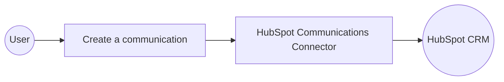

# Example

## What you'll build

Build a WSO2 Integrator Automation that creates a communication engagement (such as an email log) in HubSpot CRM and prints the result to the log. The integration connects to HubSpot using a Private App bearer token and calls the create operation to post a new communication record.

**Operations used:**
- **Create a communication** : Creates a new communication engagement in HubSpot CRM with specified properties such as channel type, origin, and message body.

## Architecture

## Prerequisites

- A HubSpot account with a Private App access token that has `crm.objects.contacts.read` and `crm.objects.communications.write` scopes.

## Setting up the HubSpot Communications integration

> **New to WSO2 Integrator?** Follow the [Create a New Integration](../../../../develop/create-integrations/create-new-integration.md) guide to set up your integration first, then return here to add the connector.

## Adding the HubSpot Communications connector

### Step 1: Open the Add Connection panel

Select **Add Connection** (or the **+** icon in the Connections section of the side panel) to open the connector palette.

### Step 2: Search for and select the HubSpot Communications connector

Enter `hubspot` in the search field, then select **ballerinax/hubspot.crm.engagements.communications** from the results to open the **Configure Communications** form.

## Configuring the HubSpot Communications connection

### Step 3: Fill in the connection parameters

In the **Configure Communications** form, set the following parameters. Switch the **Config** field to **Expression** mode and enter the bearer-token expression referencing the `hubspotToken` configurable variable:

- **Connection Name** : The identifier used to reference this connection throughout the integration
- **Config** : The `ConnectionConfig` record wrapping a `BearerTokenConfig`; set to `{auth: {token: hubspotToken}}`

### Step 4: Save the connection

Select **Save** to create the connection. The canvas updates to show the `communicationsClient` connection node.

### Step 5: Set actual values for your configurables

1. In the left panel, select **Configurations**.
2. Set a value for each configurable listed below.

- **hubspotToken** (string) : Your HubSpot Private App access token with the required CRM scopes

## Configuring the HubSpot Communications create a communication operation

### Step 6: Add an Automation entry point

1. Select **Add Artifact** on the toolbar.
2. In the Artifacts panel, select **Automation**.
3. Select **Create** to accept the default settings. The canvas switches to the Automation flow view, showing a **Start** node and an **Error Handler** node.

### Step 7: Select and configure the Create a communication operation

Select the **+** (Add Step) button between the **Start** and **Error Handler** nodes. In the **Connections** section of the step panel, expand **communicationsClient** to reveal all available operations.

Select **Create a communication**, then configure the following parameters in the operation form:

- **Payload** : The communication record to create; set to `{associations: [], properties: {"hs_communication_channel_type": "EMAIL", "hs_communication_logged_from": "CRM", "hs_communication_body": "Hello from WSO2 Integrator"}}`
- **Result** : The variable name for the returned object; set to `result`

Select **Save** to add the step to the flow.

## Try it yourself

Try this sample in WSO2 Integration Platform.

[View source on GitHub](https://github.com/wso2/integration-samples/tree/main/connectors/hubspot.crm.engagements.communications_connector_sample)

## More code examples

The `HubSpot CRM Engagements Communications` connector provides practical examples illustrating usage in various scenarios. Explore these [examples](https://github.com/ballerina-platform/module-ballerinax-hubspot.crm.engagements.communications/tree/main/examples/), covering the following use cases:

1. [Logging WhatsApp Messages](https://github.com/ballerina-platform/module-ballerinax-hubspot.crm.engagements.communications/tree/main/examples/whatsapp-message) - This example demonstrates the usage of the HubSpot CRM Communications connector to log WhatsApp messages as CRM communications. It includes posting a communication, associating it with a specific HubSpot record, retrieving the logged communication, searching for WhatsApp messages using filters, updating a communication, and deleting a communication.

2. [Logging LinkedIn Messages](https://github.com/ballerina-platform/module-ballerinax-hubspot.crm.engagements.communications/tree/main/examples/linkedin-message) - This example demonstrates the usage of the HubSpot CRM Communications connector to log LinkedIn messages as CRM communications. It includes posting a batch of communications, associating them with specific HubSpot records, updating a batch of logged communications, retrieving a batch of communications, and deleting a batch of communications.
