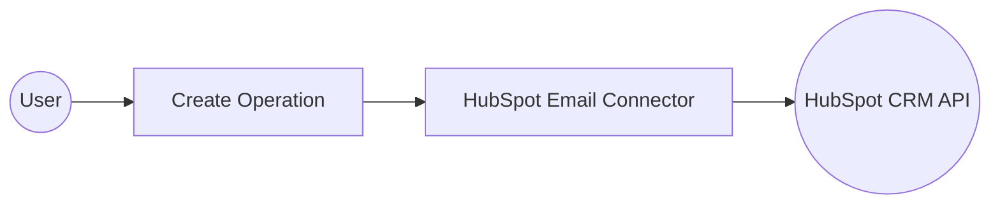

# Example

## What you'll build

Build an integration that connects to the HubSpot CRM Engagements Email API to log a new email engagement record. The integration uses an Automation entry point to invoke the `create` operation, which posts an email engagement with properties such as subject, body, direction, and status, then logs the result.

**Operations used:**
- **create** : Creates a new email engagement record in HubSpot CRM and returns the created object including its HubSpot-assigned ID

## Architecture

## Prerequisites

- A HubSpot account with a Private App access token

## Setting up the HubSpot CRM Engagements Email integration

> **New to WSO2 Integrator?** Follow the [Create a New Integration](../../../../develop/create-integrations/create-new-integration.md) guide to set up your integration first, then return here to add the connector.

## Adding the HubSpot CRM Engagements Email connector

### Step 1: Open the Add Connection panel

Select **Add Connection** (the **+** next to the **Connections** section) in the WSO2 Integrator side panel to open the connector palette.

## Configuring the HubSpot CRM Engagements Email connection

### Step 2: Fill in the connection parameters

Enter the connection details in the **Configure Email** form, binding the `Config` field to a configurable variable so the Bearer token isn't hardcoded.

- **Config** : Set to the expression `{auth: {token: hubspotToken}}`, referencing the `hubspotToken` configurable variable
- **Connection Name** : Defaults to `emailClient`

### Step 3: Save the connection

Select **Save Connection** to persist the connection. The `emailClient` node appears on the integration canvas.

### Step 4: Set actual values for your configurables

In the left panel, select **Configurations**. Set a value for each configurable listed below.

- **hubspotToken** (string) : Your HubSpot Private App access token (for example, `pat-na1-xxxxxxxx-xxxx-xxxx-xxxx-xxxxxxxxxxxx`)

## Configuring the HubSpot CRM Engagements Email create operation

### Step 5: Add an Automation entry point

Select **+ Add Artifact** on the integration overview canvas, then select **Automation** in the Artifacts panel and select **Create**. An Automation entry point named `main` is created and the flow canvas opens.

### Step 6: Select and configure the create operation

Expand the **emailClient** connection node in the flow canvas to reveal available operations, then select **Create** (the `post` operation) and fill in the payload fields.

Configure the following parameters:

- **Payload** : An `email:SimplePublicObjectInputForCreate` value containing `associations` (empty array) and `properties` with keys `hs_timestamp`, `hubspot_owner_id`, `hs_email_direction`, `hs_email_status`, `hs_email_subject`, and `hs_email_text`
- **Result variable** : Automatically named `emailSimplepublicobject`

Select **Save** to add the operation to the flow. The completed automation flow shows: Start → email:post (create email engagement) → Error Handler.

## Try it yourself

Try this sample in WSO2 Integration Platform.

[View source on GitHub](https://github.com/wso2/integration-samples/tree/main/connectors/hubspot.crm.engagements.email_connector_sample)

## More code examples

The `HubSpot CRM Engagements Email` connector provides practical examples illustrating usage in various scenarios. Explore these [examples](https://github.com/ballerina-platform/module-ballerinax-hubspot.crm.engagements.email/tree/main/examples/), covering the following use cases:

1. [Bulk update sender information in scheduled emails](https://github.com/ballerina-platform/module-ballerinax-hubspot.crm.engagements.email/tree/main/examples/bulk_update_sender_info/) - Automate the process of updating sender information for all scheduled emails, ensuring accuracy and consistency in email communication.

2. [Detect and resend failed emails](https://github.com/ballerina-platform/module-ballerinax-hubspot.crm.engagements.email/tree/main/examples/detect_resend_failed_emails/) - Identify emails with a status of "FAILED" or "BOUNCED" and attempt to resend them, ensuring important messages reach their intended recipients.

3. [Email analytics and reporting](https://github.com/ballerina-platform/module-ballerinax-hubspot.crm.engagements.email/tree/main/examples/email_analytics_reporting/) - Retrieve and analyze key email performance metrics such as sent, bounced, failed, and scheduled emails to monitor delivery status and optimize communication strategies.
