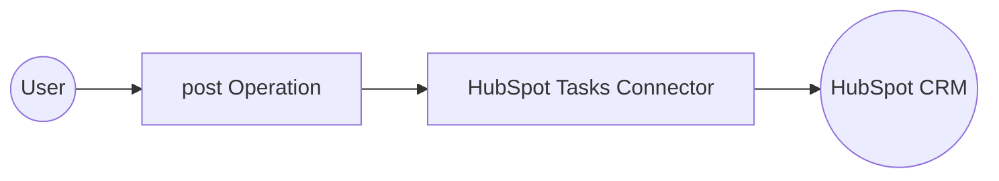

# Example

## What you'll build

Build a WSO2 Integrator automation that creates a HubSpot CRM engagement task using the `ballerinax/hubspot.crm.engagements.tasks` connector. The workflow invokes the HubSpot Tasks API with a bearer token and logs the created task object.

**Operations used:**
- **post** : Creates a new engagement task in HubSpot CRM via the `POST /crm/v3/objects/tasks` endpoint

## Architecture

## Prerequisites

- A HubSpot account with a Private App bearer token (API key)

## Setting up the HubSpot CRM engagements tasks integration

> **New to WSO2 Integrator?** Follow the [Create a New Integration](../../../../develop/create-integrations/create-a-new-integration.md) guide to set up your integration first, then return here to add the connector.

## Adding the HubSpot CRM engagements tasks connector

### Step 1: Open the Add Connection panel

Select **Connections → + Add Connection** in the WSO2 Integrator project tree to open the connector palette.

### Step 2: Select the HubSpot Tasks connector

Enter `engagements.tasks` in the search box, then select **ballerinax / hubspot.crm.engagements.tasks** (labelled "Tasks") from the results.

## Configuring the HubSpot CRM engagements tasks connection

### Step 3: Fill in the connection parameters

Configure the connection form by binding each field to a configurable variable:

- **config** : A `tasks:ConnectionConfig` record containing the bearer token — set to expression `{auth: {token: hubspotAuthToken}}`
- **serviceUrl** : The HubSpot Tasks API base URL — bind to configurable variable `hubspotServiceUrl`

### Step 4: Save the connection

Select **Save Connection** to persist the connection. Confirm that the `tasksClient` node appears in the Connections panel.

### Step 5: Set actual values for your configurables

1. In the left panel, select **Configurations**.
2. Set a value for each configurable listed below.

- **hubspotAuthToken** (string) : Your HubSpot Private App bearer token (e.g., `pat-na1-xxxxxxxx-xxxx-xxxx-xxxx-xxxxxxxxxxxx`)
- **hubspotServiceUrl** (string) : HubSpot Tasks API base URL override — leave blank to use the default

## Configuring the HubSpot CRM engagements tasks post operation

### Step 6: Add an Automation entry point

1. In the Design panel, select **+ Add Artifact**.
2. Under **Automation**, select **Automation**.
3. Select **Create** to open the flow canvas with a **Start** node and an **Error Handler** node.

### Step 7: Select and configure the post operation

1. Select the **+** placeholder node in the flow canvas (between **Start** and **Error Handler**).
2. Under **Connections**, expand **tasksClient** to reveal available operations.

3. Select **Create a task** to open the configuration form, then fill in the following parameters:

- **payload** : The task record containing `associations` and `properties` — set to an expression with `hs_task_subject`, `hs_task_body`, `hs_task_priority`, `hs_task_type`, and `hs_timestamp` fields
- **resultVariable** : Set to `result` to store the returned `tasks:SimplePublicObject`

Select **Save** to add the operation to the flow.

## Try it yourself

Try this sample in WSO2 Integration Platform.

[View source on GitHub](https://github.com/wso2/integration-samples/tree/main/connectors/hubspot.crm.engagements.tasks_connector_sample)

## More code examples

The `HubSpot CRM Tasks` connector provides practical examples illustrating usage in various scenarios. Explore these [examples](https://github.com/ballerina-platform/module-ballerinax-hubspot.crm.engagements.tasks/tree/main/examples), covering the following use cases:

1. [Task management in HubSpot CRM](https://github.com/ballerina-platform/module-ballerinax-hubspot.crm.engagements.tasks/tree/main/examples/assign-or-extend-a-task) - This example searches for a task in HubSpot CRM by its subject, creating a new one if none exists or updating details like the due date and priority if found.

2. [Task completion and status change in HubSpot CRM](https://github.com/ballerina-platform/module-ballerinax-hubspot.crm.engagements.tasks/tree/main/examples/mark-a-task-as-completed) - This example checks a task's status in HubSpot CRM and updates it to "Completed" if necessary, ensuring efficient task management.
