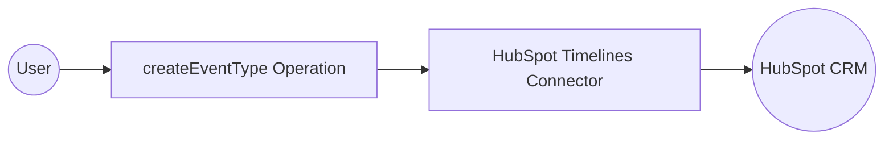

# Example

## What you'll build

Build a WSO2 Integrator automation that uses the HubSpot CRM Extensions Timelines connector to create a custom timeline event template in HubSpot CRM. The integration authenticates with a Bearer token stored as a configurable variable and calls the `createEventType` operation to register a new event template scoped to a specific HubSpot app.

**Operations used:**
- **createEventType** : Creates a new custom timeline event template for a HubSpot private app, scoped to a CRM object type such as contacts, companies, or deals

## Architecture

## Prerequisites

- A HubSpot developer account with a private app token that has Timeline API scopes

## Setting up the HubSpot Timelines integration

> **New to WSO2 Integrator?** Follow the [Create a New Integration](../../../../develop/create-integrations/create-a-new-integration.md) guide to set up your integration first, then return here to add the connector.

## Adding the HubSpot Timelines connector

Select **Add Connection** in the **Connections** section of the WSO2 Integrator sidebar. The connector palette opens.

Search for **hubspot.crm.extensions.timelines** in the search field, then select the **Timelines** connector card to open the connection configuration form.

## Configuring the HubSpot Timelines connection

### Step 1: Fill in the connection parameters

In the **Configure Timelines** form, bind each connection parameter to a configurable variable:

- **auth.token** : Bind to the `hubspotAuthToken` configurable variable to supply your HubSpot Bearer token

Keep the **Connection Name** as `timelinesClient`.

### Step 2: Save the connection

Select **Save Connection** to persist the connection. The connector is added to the canvas and appears under **Connections** in the sidebar.

### Step 3: Set actual values for your configurables

1. In the left panel, select **Configurations**.
2. Set a value for each configurable listed below.

- **hubspotAuthToken** (string) : Your HubSpot private app Bearer token (for example, `pat-na1-xxxxxxxx-xxxx-xxxx-xxxx-xxxxxxxxxxxx`)

## Configuring the HubSpot Timelines createEventType operation

### Step 4: Add an Automation entry point

On the canvas overview, select **+ Add Artifact**. In the **Artifacts** panel, select **Automation**, then select **Create** to scaffold the automation with a `main()` function.

### Step 5: Select and configure the createEventType operation

Select the **+** placeholder node between **Start** and **Error Handler** on the Automation canvas. The node panel opens. Under **Connections**, select **timelinesClient** to expand all available operations.

Select **Create an event template for the app** (maps to `createEventType`). In the operation form, fill in the following fields:

- **appId** : Your HubSpot app ID
- **payload** : A `TimelineEventTemplateCreateRequest` record specifying the template name, an empty `tokens` list, and the target `objectType` (for example, `"contacts"`, `"companies"`, or `"deals"`)
- **result** : The variable name for the returned `TimelineEventTemplate`

Select **Save** to add the operation node to the canvas.

## Try it yourself

Try this sample in WSO2 Integration Platform.

[View source on GitHub](https://github.com/wso2/integration-samples/tree/main/connectors/hubspot.crm.extensions.timelines_connector_sample)

## More code examples

The `HubSpot CRM Timelines` connector provides practical examples illustrating usage in various scenarios. Explore these [examples](https://github.com/ballerina-platform/module-ballerinax-hubspot.crm.extensions.timelines/tree/main/examples/), covering the following use cases:

1. [Event Creation](https://github.com/ballerina-platform/module-ballerinax-hubspot.crm.extensions.timelines/tree/main/examples/create-event): This example demonstrates how to create a timeline event template, retrieving existing events, and creating an event using the template with their details in a structured format.
