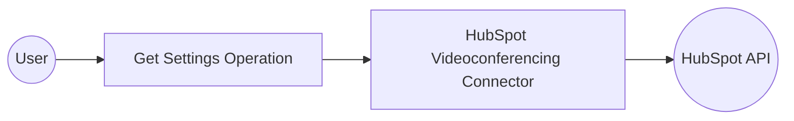

# Example

## What you'll build

Build a WSO2 Integrator integration that retrieves videoconferencing settings from HubSpot using the `ballerinax/hubspot.crm.extensions.videoconferencing` connector. The integration calls the HubSpot Videoconferencing Extensions API and logs the retrieved settings as JSON.

**Operations used:**
- **Get settings** : Retrieves videoconferencing settings for a specified HubSpot video conference application

## Architecture

## Prerequisites

- A HubSpot developer account with a registered video conference app
- Your HubSpot API key (`hapikey`)
- Your video conference application ID (`appId`)

## Setting up the HubSpot videoconferencing integration

> **New to WSO2 Integrator?** Follow the [Create a New Integration](../../../../develop/create-integrations/create-new-integration.md) guide to set up your integration first, then return here to add the connector.

## Adding the HubSpot videoconferencing connector

### Step 1: Open the connector palette

Select **+ Add Artifact → Connection** (or select the **+** next to **Connections** in the sidebar) to open the connector palette.

### Step 2: Select the videoconferencing connector

1. Enter "videoconferencing" in the search field.
2. Select **Videoconferencing** from the `ballerinax/hubspot.crm.extensions.videoconferencing` package to open the connection form.

## Configuring the HubSpot videoconferencing connection

### Step 3: Fill in the connection parameters

Bind all connection fields to configurable variables so credentials are never hard-coded. Configure the following parameters:

- **hapikey** : Your HubSpot API key, bound to a configurable variable
- **serviceUrl** : The HubSpot Videoconferencing API base URL, bound to a configurable variable
- **connectionName** : Keep the default `videoconferencingClient`

### Step 4: Save the connection

Select **Save Connection** to persist the connection. Confirm that `videoconferencingClient` appears in the **Connections** panel.

### Step 5: Set actual values for your configurables

In the left panel, select **Configurations** and set a value for each configurable listed below:

- **hubspotVideoconfHapiKey** (string) : Your HubSpot API key
- **hubspotVideoconfServiceUrl** (string) : The HubSpot Videoconferencing API base URL (for example, `https://api.hubapi.com/crm/v3/extensions/videoconferencing/settings`)
- **hubspotVideoconfAppId** (int) : The video conference application ID registered in your HubSpot developer portal

## Configuring the HubSpot videoconferencing Get settings operation

### Step 6: Add an Automation entry point

1. In the **Design** overview, select **+ Add Artifact**.
2. Under **Automation**, select **Automation**.
3. In the **Create New Automation** form, select **Create** to accept the default settings.

The Automation flow canvas opens with **Start** and **Error Handler** nodes.

### Step 7: Select and configure the Get settings operation

Select the **+** button between **Start** and **Error Handler**, then expand **Connections → videoconferencingClient** in the node panel. Select **Get settings** and configure the following parameter:

- **appId** : The video conference application ID, bound to the `hubspotVideoconfAppId` configurable variable (cast to `int:Signed32`)

Select **Save** to apply the configuration.

## Try it yourself

Try this sample in WSO2 Integration Platform.

[View source on GitHub](https://github.com/wso2/integration-samples/tree/main/connectors/hubspot.crm.extensions.videoconferencing_connector_sample)

## More code examples

The `HubSpot CRM Video conference connector` provides practical examples illustrating usage in various scenarios. Explore these [examples](https://github.com/ballerina-platform/module-ballerinax-hubspot.crm.extensions.videoconferencing/tree/main/examples/), covering the following use cases:

1. [Save settings for a video conferencing service](https://github.com/ballerina-platform/module-ballerinax-hubspot.crm.extensions.videoconferencing/tree/main/examples/operate-conference-service/) - This example demonstrates how to save settings in HubSpot CRM for a video conferencing service using the connector.
2. [Remove saved settings for a video conferencing service](https://github.com/ballerina-platform/module-ballerinax-hubspot.crm.extensions.videoconferencing/tree/main/examples/close-conference-service/) - This example demonstrates how to remove the saved settings in HubSpot CRM for an external video conferencing application using the connector.
