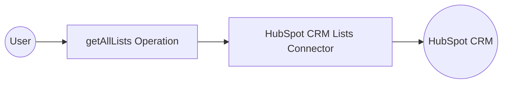

# Example

## What you'll build

Build a WSO2 Integrator automation that connects to HubSpot CRM and retrieves all CRM lists using the `ballerinax/hubspot.crm.lists` connector. The integration authenticates with a Bearer token and returns the full list of HubSpot CRM lists as a JSON response.

**Operations used:**
- **getAllLists** : Fetches all HubSpot CRM lists and returns a `lists:ListsByIdResponse` result

## Architecture

## Prerequisites

- A HubSpot account with a valid Bearer token (private app token)

## Setting up the HubSpot CRM Lists integration

> **New to WSO2 Integrator?** Follow the [Create a New Integration](../../../../develop/create-integrations/create-new-integration.md) guide to set up your integration first, then return here to add the connector.

## Adding the HubSpot CRM Lists connector

### Step 1: Open the Add Connection palette

Select **Add Artifact → Connection** (or select **+** next to **Connections** in the sidebar) to open the connector search palette.

### Step 2: Add an Automation entry point

1. Select **+ Add Artifact** on the canvas.
2. Select **Automation** in the artifact palette.
3. Select **Create** to add a new automation with default settings.

The automation flow opens showing a **Start** → **Error Handler** skeleton.

## Configuring the HubSpot CRM Lists connection

### Step 3: Fill in the connection parameters

The **Configure Lists** form opens. Use configurable variables to bind the connection parameters securely.

- **auth** : Bearer token configuration referencing the `hubspotToken` configurable variable — enter `{auth: {token: hubspotToken}}` in the **Config** expression field
- **connectionName** : Name for this connection — keep the default `listsClient`

### Step 4: Save the connection

Select **Save Connection** to persist the connection. The canvas returns to the project overview and shows the `listsClient` connection node in the **Design** area.

### Step 5: Set actual values for your configurables

1. In the left panel, select **Configurations**.
2. Set a value for each configurable listed below.

- **hubspotToken** (string) : Your HubSpot private app Bearer token

## Configuring the HubSpot CRM Lists getAllLists operation

### Step 6: Select and configure the getAllLists operation

Select the **+** button between **Start** and **Error Handler** to open the step-addition panel.

In the **Connections** section of the panel, expand **listsClient** and select **Get Get All** (corresponding to `getAllLists`). Configure the operation fields:

- **Description** : A label for this step — enter `Fetch Multiple Lists`
- **Result** : The variable to store the response — enter `result`
- **Result Type** : The type of the response — set to `lists:ListsByIdResponse`

Select **Save** to add the step to the flow.

## Try it yourself

Try this sample in WSO2 Integration Platform.

[View source on GitHub](https://github.com/wso2/integration-samples/tree/main/connectors/hubspot.crm.lists_connector_sample)

## More code examples

The `HubSpot CRM Lists` connector provides practical examples illustrating usage in various scenarios. Explore these [examples](https://github.com/ballerina-platform/module-ballerinax-hubspot.crm.lists/tree/main/examples/), covering the following use cases:

1. [Customer Support Ticket Manager](https://github.com/ballerina-platform/module-ballerinax-hubspot.crm.lists/tree/main/examples/customer_support_tickets_manager) - Integrates with HubSpot CRM Lists to create filtered lists of customer support tickets based on the priority level of the ticket.
2. [Leads Tracker](https://github.com/ballerina-platform/module-ballerinax-hubspot.crm.lists/tree/main/examples/leads_tracker) - Integrates with HubSpot CRM Lists to create Manual Lists and add leads(contacts) to the lists.
