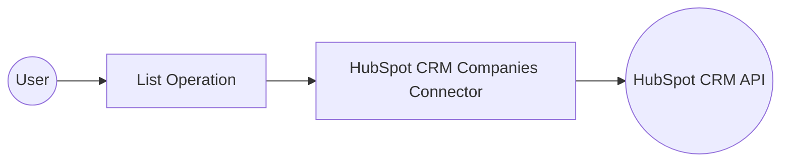

# Example

## What you'll build

Build a WSO2 Integrator automation that connects to the HubSpot CRM Companies API, calls the **List** operation to retrieve all companies, and logs the response. The integration uses a configurable Bearer token for secure authentication.

**Operations used:**
- **List** : Retrieves a collection of HubSpot CRM companies using `GET /crm/v3/objects/companies`

## Architecture

## Prerequisites

- A HubSpot account with a Private App access token (Bearer token) that has CRM Companies read permissions

## Setting up the HubSpot CRM Companies integration

> **New to WSO2 Integrator?** Follow the [Create a New Integration](../../../../develop/create-integrations/create-new-integration.md) guide to set up your integration first, then return here to add the connector.

## Adding the HubSpot CRM Companies connector

### Step 1: Open the Add connection palette

Select **+ Add Connection** to open the connector palette. Search for `hubspot.crm.obj.companies` to locate the pre-built connector.

## Configuring the HubSpot CRM Companies connection

### Step 2: Fill in the connection parameters

Select the **Companies** connector card to open the **Configure Companies** form. Set the connection parameters using configurable variables:

- **Config** : Authentication configuration that references the `hubspotToken` configurable variable — enter `{auth: {token: hubspotToken}}` in Expression mode
- **Connection Name** : Name used to identify this connection on the canvas

### Step 3: Save the connection

Select **Save Connection** to persist the connection. `companiesClient` appears under **Connections** in the sidebar and as a node on the integration canvas.

### Step 4: Set actual values for your configurables

In the left panel, select **Configurations**. Set a value for each configurable listed below:

- **hubspotToken** (string) : Your HubSpot Private App access token with CRM Companies read permissions

## Configuring the HubSpot CRM Companies List operation

### Step 5: Add an Automation entry point

1. In the Design panel, select **+ Add Artifact**.
2. Select **Automation** from the artifact list.
3. In the **Create New Automation** dialog, keep the default settings and select **Create**.

The Automation entry point (`main`) is added under **Entry Points** in the sidebar. The canvas shows the flow with a **Start** node and an **Error Handler** node.

### Step 6: Select and configure the List operation

1. Select the **+** (add step) button between **Start** and **Error Handler** on the canvas to open the node panel.
2. Under **Connections**, select **companiesClient** to expand it and view all available operations.

3. Select **List** (`GET /crm/v3/objects/companies`) to open the operation configuration panel.
4. Set the result variable name to `result`. No required parameters are needed; optional query parameters are available via **Advanced Configurations**.

- **Result** : Variable name that stores the returned collection of companies

Select **Save** to add the operation to the canvas.

## Try it yourself

Try this sample in WSO2 Integration Platform.

[View source on GitHub](https://github.com/wso2/integration-samples/tree/main/connectors/hubspot.crm.obj.companies_connector_sample)

## More code examples

The `Ballerina HubSpot CRM Companies Connector` connector provides practical examples illustrating usage in various scenarios. Explore these [examples](https://github.com/ballerina-platform/module-ballerinax-hubspot.crm.object.companies/tree/main/examples/), covering the following use cases:

1. [Create Count Delete Companies](https://github.com/ballerina-platform/module-ballerinax-hubspot.crm.object.companies/tree/main/examples/Company_create_count_delete) - see how the HubSpot API can be used to create, count and delete companies.
2. [Update and Merge Companies](https://github.com/ballerina-platform/module-ballerinax-hubspot.crm.object.companies/tree/main/examples/Company_update_merge) - see how the HubSpot API can be used to merge and update companies.
