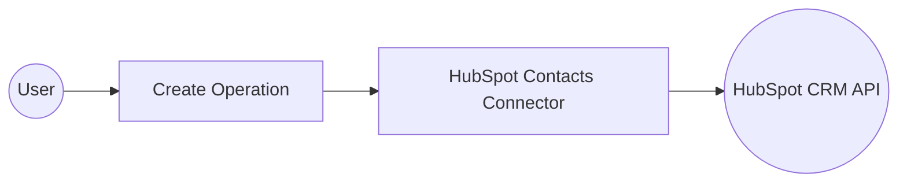

# Example

## What you'll build

Build an automation that uses the HubSpot CRM Contacts connector to create a new contact and log the response. The integration connects to the HubSpot CRM API using a private app access token stored as a configurable variable.

**Operations used:**
- **Create** : Creates a new contact in HubSpot CRM with properties such as email, first name, last name, and phone number.

## Architecture

## Prerequisites

- A HubSpot account with a private app access token

## Setting up the HubSpot Contacts integration

> **New to WSO2 Integrator?** Follow the [Create a New Integration](../../../../develop/create-integrations/create-a-new-integration.md) guide to set up your integration first, then return here to add the connector.

## Adding the HubSpot Contacts connector

### Step 1: Open the Add Connection palette

Select **+ Add Connection** in the Connections section of the canvas to open the connector palette.

## Configuring the HubSpot Contacts connection

### Step 2: Fill in the connection parameters

Enter the following parameters in the **Configure Contacts** form, binding each to a configurable variable to keep secrets out of source code:

- **Config** : Authentication configuration — set to an expression that references the `hubspotToken` configurable variable
- **Service Url** : The HubSpot API base URL — bound to the `hubspotServiceUrl` configurable variable
- **Connection Name** : A unique name for this connection instance

### Step 3: Save the connection

Select **Save Connection** to persist the connection. The `contactsClient` node appears on the canvas and under **Connections** in the project tree.

### Step 4: Set actual values for your configurables

1. In the left panel, select **Configurations**.
2. Set a value for each configurable listed below.

- **hubspotToken** (string) : Your HubSpot private app access token
- **hubspotServiceUrl** (string) : The HubSpot CRM Contacts API base URL (for example, `https://api.hubapi.com/crm/v3/objects/contacts`)

## Configuring the HubSpot Contacts Create operation

### Step 5: Add an Automation entry point

1. Select **+ Add Artifact** on the canvas.
2. Under the **Automation** section, select **Automation**.
3. On the **Create New Automation** screen, select **Create**.

The flow canvas now shows: **Start → (empty slot) → Error Handler**.

### Step 6: Select and configure the Create operation

1. Select the **+** (add step) button between **Start** and **Error Handler** in the flow canvas.
2. Under **Connections**, expand **contactsClient** to reveal all available operations.

3. Select **Create** (the `postCrmV3ObjectsContacts` operation).
4. In the operation form, configure the following parameters:

- **Payload** : Contact properties to create — enter an expression with `email`, `firstname`, `lastname`, and `phone` fields
- **Result** : The variable name to store the returned `SimplePublicObject`

5. Select **Save** to add the step to the flow.

## Try it yourself

Try this sample in WSO2 Integration Platform.

[View source on GitHub](https://github.com/wso2/integration-samples/tree/main/connectors/hubspot.crm.obj.contacts_connector_sample)

## More code examples

The `Ballerina HubSpot CRM Contacts Connector` connector provides practical examples illustrating usage in various scenarios. Explore these [examples](https://github.com/ballerina-platform/module-ballerinax-hubspot.crm.object.contacts/tree/main/examples/), covering the following use cases:

1. [Email-Advertising](https://github.com/ballerina-platform/module-ballerinax-hubspot.crm.object.contacts/tree/main/examples/Email-Advertising) - Unsubscribe and remove customers based on email addresses of CSV-imported data.
2. [Event-Registration](https://github.com/ballerina-platform/module-ballerinax-hubspot.crm.object.contacts/tree/main/examples/Event-Registration) - Event registration and follow-up using CSV-imported data.
