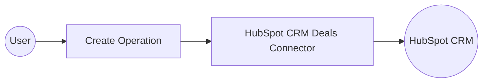

# Example

## What you'll build

Build a WSO2 Integrator automation that creates a HubSpot CRM deal using the `ballerinax/hubspot.crm.obj.deals` connector. The integration configures a connection with a private app access token and submits a deal payload to the HubSpot CRM API.

**Operations used:**
- **Create** : Creates a new deal record in HubSpot CRM with specified properties such as deal name, amount, stage, pipeline, and close date

## Architecture

## Prerequisites

- A HubSpot account with a private app access token (bearer token)

## Setting up the HubSpot CRM Deals integration

> **New to WSO2 Integrator?** Follow the [Create a New Integration](../../../../develop/create-integrations/create-a-new-integration.md) guide to set up your integration first, then return here to add the connector.

## Adding the HubSpot CRM Deals connector

### Step 1: Open the Add Connection panel

Select the **+** button in the **Connections** section of the left panel to open the **Add Connection** dialog.

## Configuring the HubSpot CRM Deals connection

### Step 2: Fill in the connection parameters

Search for `hubspot.crm.obj.deals`, select the **Deals** connector card, and bind the connection parameters to configurable variables.

- **Config** : The connection configuration record containing the bearer token auth expression `{auth: {token: hubspotToken}}`
- **Connection Name** : The name used to reference this connection throughout the integration

### Step 3: Save the connection

Select **Save Connection** to persist the connection. The `dealsClient` connection node appears on the canvas and in the **Connections** panel.

### Step 4: Set actual values for your configurables

1. In the left panel, select **Configurations**.
2. Set a value for each configurable listed below.

- **hubspotToken** (string) : Your HubSpot private app access token used to authenticate API requests

## Configuring the HubSpot CRM Deals Create operation

### Step 5: Add an Automation entry point

1. In the left panel, hover over **Entry Points** and select the **+** button.
2. Under **Automation**, select the **Automation** card.
3. Select **Create** to scaffold the `main` automation and open the flow canvas.

### Step 6: Select the Create operation and configure its parameters

1. Select the **+** button between **Start** and **Error Handler** on the flow canvas to open the node panel.
2. Expand **dealsClient** in the **Connections** section to reveal available operations.

3. Select **Create** from the operations list and fill in the operation fields.

- **Payload** : The `SimplePublicObjectInputForCreate` record containing deal properties such as `dealname`, `amount`, `dealstage`, `pipeline`, and `closedate`
- **Result** : The variable name that stores the returned `SimplePublicObject` response

4. Select **Save** to add the step to the flow.

## Try it yourself

Try this sample in WSO2 Integration Platform.

[View source on GitHub](https://github.com/wso2/integration-samples/tree/main/connectors/hubspot.crm.obj.deals_connector_sample)

## More code examples

The `ballerinax/hubspot.crm.obj.deals` connector provides practical examples illustrating usage in various scenarios.

1. [Create and Manage Deals](https://github.com/ballerina-platform/module-ballerinax-hubspot.crm.object.deals/tree/main/examples/manage-deals) - See how the HubSpot API can be used to create deals and manage them through the sales pipeline.
2. [Count Deals in Stages](https://github.com/ballerina-platform/module-ballerinax-hubspot.crm.object.deals/tree/main/examples/count-deals) - See how the HubSpot API can be used to count the number of deals in each stage of the sales pipeline.
