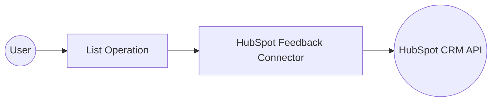

# Example

## What you'll build

This integration retrieves HubSpot CRM Feedback Submission objects using a scheduled Automation entry point that periodically lists feedback submissions and logs them as JSON. The workflow connects to HubSpot's CRM API using a bearer token and outputs the full response for monitoring or downstream processing.

**Operations used:**
- **List** : Retrieves all feedback submissions from HubSpot CRM and assigns the result to a variable for logging

## Architecture

## Prerequisites

- A HubSpot account with API access enabled
- A HubSpot Bearer Token (Private App access token) with permission to read CRM objects

## Setting up the HubSpot CRM Feedback Submissions integration

> **New to WSO2 Integrator?** Follow the [Create a New Integration](../../../../develop/create-integrations/create-a-new-integration.md) guide to set up your integration first, then return here to add the connector.

## Adding the HubSpot CRM Feedback Submissions connector

### Step 1: Open the connector search palette

Select **+ Add Artifact** → **Connection** on the integration overview canvas to open the connector search palette.

### Step 2: Add an Automation entry point

Select **+ Add Artifact**, then select **Automation**. In the **Create New Automation** form, select **Create** to accept the default settings. The canvas switches to the Automation flow editor showing **Start** and **Error Handler** nodes.

## Configuring the HubSpot CRM Feedback Submissions connection

### Step 3: Fill in the connection parameters

Search for `hubspot` in the palette and select the `ballerinax/hubspot.crm.obj.feedback` connector card to open the **Configure Feedback** form. Bind each field to a configurable variable:

- **Config** : Authentication configuration using `{auth: {token: hubspotToken}}`, where `hubspotToken` is a configurable string variable
- **Connection Name** : A unique name for this connection instance

### Step 4: Save the connection

Select **Save Connection** to persist the connection. The canvas displays the `feedbackClient` connection node confirming the connection was created successfully.

### Step 5: Set actual values for your configurables

1. In the left panel, select **Configurations**.
2. Set a value for each configurable listed below.

- **hubspotToken** (string) : Your HubSpot Private App bearer token (for example, `pat-na1-xxxxxxxx-xxxx-xxxx-xxxx-xxxxxxxxxxxx`)

## Configuring the HubSpot CRM Feedback Submissions List operation

### Step 6: Select and configure the List operation

1. Select the **+** button between the **Start** and **Error Handler** nodes.
2. In the right-hand step panel, expand **feedbackClient** under **Connections**.
3. Select **List** to open the operation form.

Configure the operation with the following value:

- **Result** : The variable name to store the returned feedback submissions collection

## Try it yourself

Try this sample in WSO2 Integration Platform.

[View source on GitHub](https://github.com/wso2/integration-samples/tree/main/connectors/hubspot.crm.obj.feedback_connector_sample)

## More code examples

The `HubSpot CRM Feedback` connector provides practical examples illustrating usage in various scenarios.

1. [Feedback Reviewing](https://github.com/ballerina-platform/module-ballerinax-hubspot.crm.object.feedback/tree/main/examples/feedback_review) - This example demonstrates the usage of the HubSpot CRM Feedback connector to read a page of feedback submissions, read an object identified by `{feedbackSubmissionId}`, read a batch of feedback submissions by internal ID, or unique property values, and search feedback submissions.

> **Note**: The feedback submissions endpoints are currently read-only. Feedback submissions cannot be submitted or edited through the API. You can only create properties in the [feedback surveys tool within HubSpot](https://knowledge.hubspot.com/customer-feedback/create-a-custom-survey), and the properties cannot be edited after creation.
