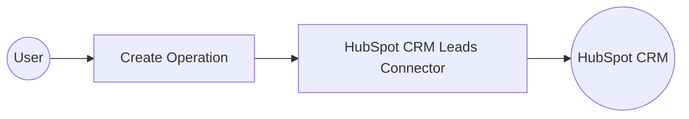

# Example

## What you'll build

Build an integration that creates a new lead in HubSpot CRM using the `hubspot.crm.obj.leads` connector and an Automation entry point. The integration calls the Create operation to submit lead data and returns the resulting object.

**Operations used:**
- **Create** : Creates a new lead in HubSpot CRM with the specified properties and associations

## Architecture

## Prerequisites

- A HubSpot account with a valid Private App Access Token (Bearer Token) that has CRM Leads read/write scope

## Setting up the HubSpot CRM Leads integration

> **New to WSO2 Integrator?** Follow the [Create a New Integration](../../../../develop/create-integrations/create-new-integration.md) guide to set up your integration first, then return here to add the connector.

## Adding the HubSpot CRM Leads connector

### Step 1: Open the connector palette and select the HubSpot CRM Leads connector

1. In the WSO2 Integrator sidebar, select **Add Artifact → Connection**.
2. Search for `hubspot.crm.obj.leads` in the connector palette.
3. Select the **HubSpot CRM Leads** connector card from the search results.

## Configuring the HubSpot CRM Leads connection

### Step 2: Fill in the connection parameters

Bind the connection field to a configurable variable for secure token management:

- **Config** : Set to Expression mode and enter the record literal binding the `hubspotAuthToken` configurable variable for Bearer Token authentication
- **Connection Name** : Set to `leadsClient`

### Step 3: Save the connection

Select **Save** to persist the connection. The `leadsClient` connection node appears on the canvas and is listed under **Connections** in the sidebar.

### Step 4: Set actual values for your configurables

1. In the left panel, select **Configurations**.
2. Set a value for each configurable listed below.

- **hubspotAuthToken** (string) : Your HubSpot Private App Access Token with CRM Leads read/write scope

## Configuring the HubSpot CRM Leads Create operation

### Step 5: Add an Automation entry point

1. In the sidebar, select **Entry Points → Add Entry Point**.
2. Select **Automation**.
3. In the Create New Automation form, select **Create** to use default settings.

An Automation entry point named `main` appears under **Entry Points**, and the canvas shows the flow with **Start** and **Error Handler** nodes.

### Step 6: Select the Create operation and configure its parameters

1. Select the **+** between **Start** and **Error Handler** on the canvas.
2. Under **Connections**, expand `leadsClient` to reveal available operations.
3. Select **Create** from the operations list.

Configure the operation fields:

- **Payload** : Set to Expression mode and enter the associations and properties record for the new lead
- **Result** : Set to `result`

Select **Save**.

## Try it yourself

Try this sample in WSO2 Integration Platform.

[View source on GitHub](https://github.com/wso2/integration-samples/tree/main/connectors/hubspot.crm.obj.leads_connector_sample)

## More code examples

The `ballerinax/hubspot.crm.obj.leads` connector provides practical examples illustrating usage in various scenarios. Explore these examples, covering the following use cases:

- [**Real Estate Inquiry Leads**](https://github.com/ballerina-platform/module-ballerinax-hubspot.crm.object.leads/tree/main/examples/real_estate_inquiry_leads): Learn how the HubSpot API can be used to manage and process leads from real estate inquiries.
- [**Fitness Center Leads**](https://github.com/ballerina-platform/module-ballerinax-hubspot.crm.object.leads/tree/main/examples/fitness_center_leads): Discover how the HubSpot API can be utilized to handle leads for fitness center memberships and services.
