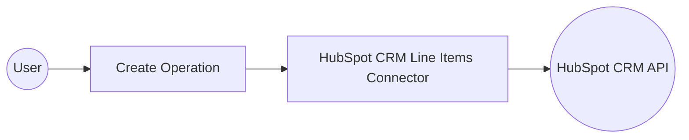

# Example

## What you'll build

Build a WSO2 Integrator automation that uses the HubSpot CRM Line Items connector to create a new line item in HubSpot CRM via the HubSpot API. The integration configures a connection with a Bearer token and invokes the `create` operation with product details such as name, price, and quantity.

**Operations used:**
- **create** : Creates a new line item in HubSpot CRM with the specified properties and associations

## Architecture

## Prerequisites

- A HubSpot account with API access and a Bearer token

## Setting up the HubSpot CRM Line Items integration

> **New to WSO2 Integrator?** Follow the [Create a New Integration](../../../../develop/create-integrations/create-a-new-integration.md) guide to set up your integration first, then return here to add the connector.

## Adding the HubSpot CRM Line Items connector

### Step 1: Open the Add Connection panel

Select **+ Add Artifact → Connection** on the canvas, or select **Add Connection** in the WSO2 Integrator sidebar to open the connector palette.

### Step 2: Add an Automation entry point

Select **+ Add Artifact** on the canvas and select **Automation**. In the **Create New Automation** dialog, select **Create**. The Automation entry point (`main`) is now listed under **Entry Points** in the sidebar.

## Configuring the HubSpot CRM Line Items connection

### Step 3: Fill in the connection parameters

Enter the connection details by binding each field to a configurable variable. In the **Configure Lineitems** form, set the following parameters:

- **Config** : A `ConnectionConfig` record containing the Bearer token for HubSpot API authentication — bind to a configurable variable (for example, `hubspotToken`)
- **Connection Name** : A name to identify this connection (for example, `lineitemsClient`)

### Step 4: Save the connection

Select **Save Connection** to persist the connection. The canvas updates to show the `lineitemsClient` connection node.

### Step 5: Set actual values for your configurables

1. In the left panel, select **Configurations**.
2. Set a value for each configurable listed below.

- **hubspotToken** (string) : Your HubSpot Bearer token used for API authentication

## Configuring the HubSpot CRM Line Items create operation

### Step 6: Expand the connection node to view available operations

In the Automation flow view, select the **+** button between the **Start** and **Error Handler** nodes to open the node panel. Expand **Connections → lineitemsClient** to reveal all available operations.

### Step 7: Select the create operation and configure its parameters

Select **Create** to add the create line item operation. In the **Create** operation form, configure the following parameters:

- **Payload** : A record containing the line item properties — set `associations` to an empty array and `properties` to include fields such as `hs_product_id`, `quantity`, `price`, and `name`
- **Result** : The variable name to store the response (for example, `result`)

Select **Save** to apply the configuration.

## Try it yourself

Try this sample in WSO2 Integration Platform.

[View source on GitHub](https://github.com/wso2/integration-samples/tree/main/connectors/hubspot.crm.obj.lineitems_connector_sample)

## More code examples

The `Ballerina HubSpot CRM Lineitems Connector` connector provides practical examples illustrating usage in various scenarios. Explore these [examples](https://github.com/ballerina-platform/module-ballerinax-hubspot.crm.object.lineitems/tree/main/examples/), covering the following use cases:

1. [Customer Order fulfillment](https://github.com/ballerina-platform/module-ballerinax-hubspot.crm.object.lineitems/tree/main/examples/customer-order-fulfillment) - Manage customer orders in a warehouse system
2. [Inventory management](https://github.com/ballerina-platform/module-ballerinax-hubspot.crm.object.lineitems/tree/main/examples/inventory-management) - Manage inventory for an operational deal in an E-commerce platform
