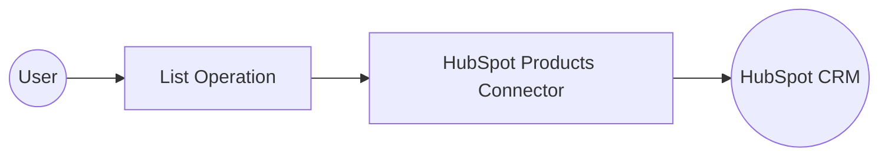

# Example

## What you'll build

Build a WSO2 Integrator automation that connects to HubSpot CRM and retrieves a list of products using the `ballerinax/hubspot.crm.obj.products` connector. The integration uses an Automation entry point to call the HubSpot CRM Products API and returns the product collection as a JSON response.

**Operations used:**
- **List** : Retrieves a paginated list of CRM products from HubSpot

## Architecture

## Prerequisites

- A HubSpot account with a Private App access token (Bearer token) that has CRM Products read permissions

## Setting up the HubSpot Products integration

> **New to WSO2 Integrator?** Follow the [Create a New Integration](../../../../develop/create-integrations/create-new-integration.md) guide to set up your integration first, then return here to add the connector.

## Adding the HubSpot Products connector

### Step 1: Open the Add Connection panel

1. In the left sidebar, select **Connections** (or the **+** icon next to it).
2. The **Add Connection** panel opens showing the connector marketplace.
3. In the search box, enter `hubspot`.
4. Locate **Products (ballerinax/hubspot.crm.obj.products)** in the results.
5. Select the connector card to open the **Configure Products** form.

## Configuring the HubSpot Products connection

### Step 2: Fill in the connection parameters

Bind the connection parameters to configurable variables. Select the **Config** field to open the **Record Configuration** modal, then configure the following:

- **Config** : Bearer token authentication configuration using `hubspotAuthToken` as the configurable variable — set the full expression to `{auth: {token: hubspotAuthToken}}`
- **Connection Name** : Defaults to `productsClient` — keep this value

### Step 3: Save the connection

Select **Save Connection** to persist the connection. The canvas returns to the project overview showing `productsClient` as a **Connection** node.

### Step 4: Set actual values for your configurables

1. In the left panel, select **Configurations**.
2. Set a value for each configurable listed below.

- **hubspotAuthToken** (string) : Your HubSpot Private App access token with CRM Products read permissions

## Configuring the HubSpot Products List operation

### Step 5: Add an Automation entry point

1. In the left sidebar, select **Entry Points**.
2. Select the **+** button that appears.
3. In the artifact picker, select **Automation**.
4. The **Create New Automation** form appears — select **Create**.

An Automation entry point named `main` is created. The canvas switches to the Automation flow view showing a **Start** node and an empty step placeholder.

### Step 6: Select and configure the List operation

1. Select the **+** button between the **Start** node and the **Error Handler** node.
2. The node panel slides in on the right showing available connections and statement types.

3. Under **Connections**, select **productsClient** to expand it.
4. Select **List** from the available operations.
5. In the **Result** field, clear the default value and enter `result`.
6. Select **Save**.

- **Result** : Set to `result` to store the paginated product collection returned by the API

The `products : get` node appears on the canvas with result variable `result`.

## Try it yourself

Try this sample in WSO2 Integration Platform.

[View source on GitHub](https://github.com/wso2/integration-samples/tree/main/connectors/hubspot.crm.obj.products_connector_sample)

## More code examples

The `Ballerina HubSpot CRM Products Connector` connector provides practical examples illustrating usage in various scenarios. Explore these [examples](https://github.com/ballerina-platform/module-ballerinax-hubspot.crm.object.products/tree/main/examples/), covering the following use cases:

1. [Update Batch of Products](https://github.com/ballerina-platform/module-ballerinax-hubspot.crm.object.products/tree/main/examples/update-products) - Integrate Ballerina HubSpot CRM Products Connector to update the properties of a batch of products.

2. [Filter and Archive Batch](https://github.com/ballerina-platform/module-ballerinax-hubspot.crm.object.products/tree/main/examples/search-and-archive) - Integrate Ballerina HubSpot CRM Products Connector to filter products based on the price and then archive the batch.
