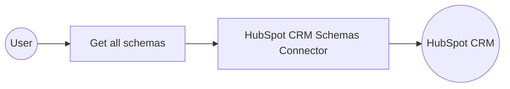

# Example

## What you'll build

Build an integration that connects to HubSpot CRM and retrieves all custom object schemas using the `ballerinax/hubspot.crm.obj.schemas` connector. The integration authenticates with a Bearer token and returns a JSON representation of every custom object schema in your HubSpot account.

**Operations used:**
- **Get all schemas** : Retrieves all custom object schemas from HubSpot CRM

## Architecture

## Prerequisites

- A HubSpot account with API access
- A valid HubSpot private app Bearer token with `crm.schemas.read` scope

## Setting up the HubSpot CRM Schemas integration

> **New to WSO2 Integrator?** Follow the [Create a New Integration](../../../../develop/create-integrations/create-a-new-integration.md) guide to set up your integration first, then return here to add the connector.

## Adding the HubSpot CRM Schemas connector

### Step 1: Open the Add Connection panel

Select the **+** button next to **Connections** in the left sidebar to open the **Add Connection** palette.

## Configuring the HubSpot CRM Schemas connection

### Step 2: Configure the connection parameters

Search for `hubspot.crm.obj.schemas`, select the **Schemas** connector card, and bind all fields to configurable variables for secure, environment-independent credential management.

1. In the **Add Connection** search palette, enter `hubspot.crm.obj.schemas`.
2. Select the **Schemas** connector from the search results to open the configuration form.
3. Switch the **Config** field to **Expression** mode and enter the expression `{auth: {token: hubspotAuthToken}}` to pass the Bearer token through the `BearerTokenConfig` auth field.
4. Bind the **Service Url** field to the configurable variable `hubspotServiceUrl`.
5. Set **Connection Name** to `schemasClient`.

- **Config** : Authentication configuration using a Bearer token bound to the `hubspotAuthToken` configurable variable
- **Service Url** : The HubSpot API base URL bound to the `hubspotServiceUrl` configurable variable
- **Connection Name** : The name used to reference this connection in the integration flow

### Step 3: Save the connection

Select **Save Connection** to register the `schemasClient` connection in your project.

### Step 4: Set actual values for your configurables

In the left panel, select **Configurations** to open the Configurations panel. Set a value for each configurable listed below.

- **hubspotAuthToken** (string) : Your HubSpot private app Bearer token with `crm.schemas.read` scope
- **hubspotServiceUrl** (string) : The HubSpot API base URL for custom object schemas (for example, `https://api.hubapi.com/crm-object-schemas/v3/schemas`)

## Configuring the HubSpot CRM Schemas get all schemas operation

### Step 5: Add an Automation entry point

Select **+ Add Artifact** in the Design section of the integration overview, then select **Automation** from the artifact type list and select **Create** to generate the `main()` function automation.

### Step 6: Select and configure the get all schemas operation

Expand the `schemasClient` connection node on the canvas to view available operations, then select **Get all schemas** and configure its parameters.

1. Select the **+** button in the Automation canvas flow to open the node panel.
2. Under **Connections**, expand **schemasClient**.
3. Select **Get all schemas** to add it to the flow.
4. Set the **Result** variable name to `result`.
5. Select **Save** to add the operation to the flow.

- **Result** : The variable that stores the retrieved collection of custom object schemas

## Try it yourself

Try this sample in WSO2 Integration Platform.

[View source on GitHub](https://github.com/wso2/integration-samples/tree/main/connectors/hubspot.crm.obj.schemas_connector_sample)

## More code examples

The `HubSpot CRM Object Schemas` connector provides practical examples illustrating usage in various scenarios. Explore these [examples](https://github.com/ballerina-platform/module-ballerinax-hubspot.crm.obj.schemas/tree/main/examples), covering the following use cases:
   1. [Author and Book association](https://github.com/ballerina-platform/module-ballerinax-hubspot.crm.obj.schemas/tree/main/examples/book-author-association)
   2. [Product spec update](https://github.com/ballerina-platform/module-ballerinax-hubspot.crm.obj.schemas/tree/main/examples/product-update)
