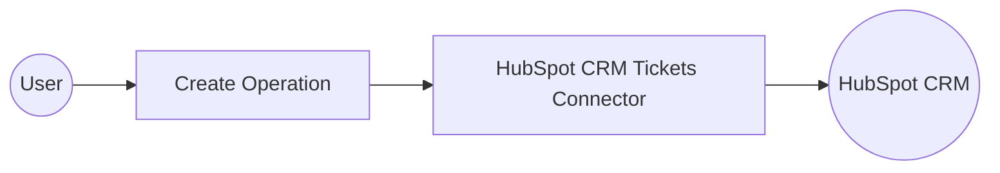

# Example

## What you'll build

Build a WSO2 Integrator automation that creates a new support ticket in HubSpot CRM using the `ballerinax/hubspot.crm.obj.tickets` connector. The workflow triggers automatically, calls the HubSpot CRM API to create a ticket with a specified subject, pipeline, stage, and priority, then logs the API response.

**Operations used:**
- **create** : Creates a new support ticket in HubSpot CRM by sending a `POST` request to `/crm/v3/objects/tickets` with a ticket payload

## Architecture

## Prerequisites

- A HubSpot account with a Private App configured with CRM `tickets` write scope
- A HubSpot Private App bearer token (access token)

## Setting up the HubSpot CRM Object Tickets integration

> **New to WSO2 Integrator?** Follow the [Create a New Integration](../../../../develop/create-integrations/create-a-new-integration.md) guide to set up your integration first, then return here to add the connector.

## Adding the HubSpot CRM Object Tickets connector

### Step 1: Open the connector palette and select the HubSpot CRM Object Tickets connector

From the integration overview canvas, select **+ Add Artifact**, then select **Connection**. In the connector search palette, enter `hubspot crm tickets` and select **HubSpot CRM Object Tickets** (`ballerinax/hubspot.crm.obj.tickets` v2.0.1).

## Configuring the HubSpot CRM Object Tickets connection

### Step 2: Fill in the connection parameters

The **New Connection** form opens. Fill in the connection parameters, binding each field to a configurable variable:

- **Connection Name** : Enter `ticketsClient` as the connection name
- **Config** : Switch to **Expression** mode and enter `{auth: {token: hubspotAuthToken}}` — this wires the `BearerTokenConfig` authentication using a configurable variable named `hubspotAuthToken`

### Step 3: Save the connection

Select **Save Connection**. The `ticketsClient` connector node appears on the integration canvas.

### Step 4: Set actual values for your configurables

1. In the left panel, select **Configurations**.
2. Set a value for each configurable listed below.

- **hubspotAuthToken** (string) : Your HubSpot Private App access token, used to authenticate requests to the HubSpot CRM API

## Configuring the HubSpot CRM Object Tickets create operation

### Step 5: Add an Automation entry point

In the WSO2 Integrator sidebar, hover over **Entry Points** to reveal the **+ Add Entry Point** button. Select it. In the artifacts panel, select **Automation**, then select **Create** with default settings. A new `Automation` entry point named `main` is created and its canvas opens.

### Step 6: Select and configure the create operation

Select the **+** node on the canvas (between **Start** and **Error Handler**) to open the node panel. In the **Connections** section, select **ticketsClient** to expand all available operations.

Select **Create** to add the `ticketsClient→post` step. In the **Create** operation form, configure the following fields:

- **Payload** : Switch to **Expression** mode and enter `{properties: {"subject": "Test HubSpot Ticket", "hs_pipeline": "0", "hs_pipeline_stage": "1", "hs_ticket_priority": "HIGH"}}`
- **Result** : Enter `result` as the result variable name

Select **Save**. The canvas updates to show the `tickets : post` node with `result` linked to `ticketsClient`.

## Try it yourself

Try this sample in WSO2 Integration Platform.

[View source on GitHub](https://github.com/wso2/integration-samples/tree/main/connectors/hubspot.crm.obj.tickets_connector_sample)

## More code examples

The `HubSpot CRM Object Tickets` connector provides practical examples illustrating usage in various scenarios. Explore these [examples](https://github.com/ballerina-platform/module-ballerinax-hubspot.crm.obj.tickets/tree/main/examples), covering the following use cases:

   1. [Ticket Management System](https://github.com/ballerina-platform/module-ballerinax-hubspot.crm.object.tickets/tree/main/examples/ticket-management-system) - Integrate HubSpot with multiple customer support channels to streamline ticket management.
   2. [Weekly Tickets Report Generation](https://github.com/ballerina-platform/module-ballerinax-hubspot.crm.object.tickets/tree/main/examples/weekly-ticket-reports) - Analyze detailed summaries of customer tickets in each week for better support
